# SocialProof Backend – Technical Implementation Document

> **Scope:** This document is the authoritative engineering reference for the **Social Proof** feature of the FesShop backend. It covers the complete backend implementation: request lifecycle, service orchestration, repository access, real-time broadcasting via Socket.IO, metric aggregation, data model, security, and operational concerns.
>
> **Audience:** Backend Engineers · Software Architects · QA Engineers · Technical Leads · SREs
>
> **Repository:** `FesShop` (Node.js + Express + TypeScript + MongoDB + Socket.IO)
>
> **Document Version:** 1.0
> **Last Updated:** July 2026

---

## Table of Contents

1. [Feature Overview](#1-feature-overview)
2. [Technology Stack](#2-technology-stack)
3. [Feature Architecture](#3-feature-architecture)
4. [Folder Structure](#4-folder-structure)
5. [Authentication & Authorization](#5-authentication--authorization)
6. [ActiveFeeds Backend](#6-activefeeds-backend)
7. [Metric APIs](#7-metric-apis)
8. [Socket Communication](#8-socket-communication)
9. [Database Design](#9-database-design)
10. [API Documentation](#10-api-documentation)
11. [Repository Layer](#11-repository-layer)
12. [Validation](#12-validation)
13. [Caching](#13-caching)
14. [Error Handling](#14-error-handling)
15. [Logging & Monitoring](#15-logging--monitoring)
16. [Security](#16-security)
17. [Performance Optimization](#17-performance-optimization)
18. [Testing Strategy](#18-testing-strategy)
19. [Sequence Diagrams](#19-sequence-diagrams)
20. [Architecture Diagrams](#20-architecture-diagrams)
21. [Best Practices](#21-best-practices)

---

## 1. Feature Overview

### 1.1 Purpose

The **Social Proof** feature captures, persists and broadcasts user-generated platform activity (signups, purchases, reviews) in near real-time. It provides two consumer-facing capabilities to the mobile / web client:

1. **ActiveFeeds** — a chronologically ordered list of the most recent activities across the platform.
2. **Metric APIs** — aggregated, daily counters (signups, purchases, reviews, active users) that power dashboards and social-validation UI widgets.

A live **WebSocket channel** (`social-proof:new`) pushes newly persisted events to every connected client without the need for polling.

### 1.2 Business Objectives

| Objective | KPI Target |
|---|---|
| Increase conversion rate through social validation | +15–30% |
| Increase session engagement / dwell time | +20% |
| Reduce cart abandonment | −10% |
| Build platform trust and community perception | Qualitative |

### 1.3 Supported Use Cases

| Use Case | Trigger | Outcome |
|---|---|---|
| Signup Broadcast | `POST /api/auth/register` | `SIGNUP` event persisted + broadcast |
| Purchase Broadcast | `POST /api/orders` (per line item) | `PURCHASE` event persisted + broadcast |
| Review Broadcast | `POST /api/reviews` | `REVIEW` event persisted + broadcast |
| Recent Activity Feed | `GET /api/social-proof/recent` | Chronological event list |
| Daily Metrics | `GET /api/social-proof/metrics` | Aggregated counters for today |
| Live Push | Socket.IO subscribe | Push of new events in real-time |

### 1.4 High-Level Architecture

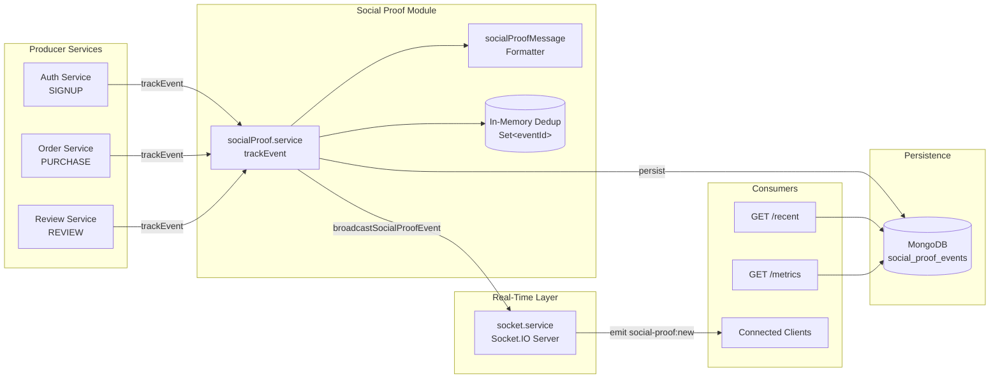
```mermaid
flowchart LR
    subgraph Producers[Producer Services]
        AUTH[Auth Service<br/>SIGNUP]
        ORDER[Order Service<br/>PURCHASE]
        REVIEW[Review Service<br/>REVIEW]
    end

    subgraph SocialProof[Social Proof Module]
        SVC[socialProof.service<br/>trackEvent]
        MSG[socialProofMessage<br/>Formatter]
        DEDUP[(In-Memory Dedup<br/>Set&lt;eventId&gt;)]
    end

    subgraph Persistence
        MONGO[(MongoDB<br/>social_proof_events)]
    end

    subgraph RealTime[Real-Time Layer]
        SOCK[socket.service<br/>Socket.IO Server]
    end

    subgraph Consumers[Consumers]
        API_REC[GET /recent]
        API_MET[GET /metrics]
        CLIENTS[Connected Clients]
    end

    AUTH -->|trackEvent| SVC
    ORDER -->|trackEvent| SVC
    REVIEW -->|trackEvent| SVC

    SVC -->|persist| MONGO
    SVC --> MSG
    SVC --> DEDUP
    SVC -->|broadcastSocialProofEvent| SOCK
    SOCK -->|emit social-proof:new| CLIENTS

    API_REC --> MONGO
    API_MET --> MONGO
```

### 1.5 Backend Responsibilities

- Validate and persist Social Proof events emitted by internal producer services (auth, order, review).
- Guarantee that a producer flow is **never broken** by a Social Proof failure (non-blocking side-effect).
- Broadcast newly persisted events to all connected Socket.IO clients exactly once.
- Serve read APIs for recent events and daily aggregated metrics.
- Enforce validation, rate limiting, and secure error handling.

### 1.6 Functional Requirements

| ID | Requirement |
|---|---|
| FR-1 | System must persist a Social Proof event for every SIGNUP, PURCHASE (per line item), and REVIEW. |
| FR-2 | System must broadcast every persisted event on the `social-proof:new` Socket.IO channel. |
| FR-3 | System must prevent duplicate broadcast of the same event ID. |
| FR-4 | `GET /recent` must return up to 100 latest events, sorted by `createdAt DESC`. |
| FR-5 | `GET /metrics` must return today's SIGNUP, PURCHASE, REVIEW counts and distinct active users (UTC-based). |
| FR-6 | Social Proof failure must never propagate as an error to the producer flow. |

### 1.7 Non-Functional Requirements

| Category | Requirement |
|---|---|
| Performance | p95 latency `< 150 ms` for `/recent` and `/metrics` under 100 rps. |
| Availability | 99.9% for read endpoints; broadcast is best-effort. |
| Scalability | Horizontally scalable stateless HTTP; Socket.IO layer is single-node today (see [§17](#17-performance-optimization) for scale-out via Redis adapter). |
| Security | Public read endpoints must be rate-limited; no PII beyond first name in payloads. |
| Observability | Every state transition logged with a `[SocialProof]` prefix. |

---

## 2. Technology Stack

| Layer | Technology | Version | Why It Is Used |
|---|---|---|---|
| Runtime | Node.js | ≥ 18 | Event-loop model is ideal for I/O-heavy, real-time workloads. |
| Language | TypeScript | ^6.0 | Compile-time safety around event enums, DTOs, and Mongoose documents. |
| Web Framework | Express | ^5.2 | Minimal, mature, middleware-oriented HTTP layer. |
| Database | MongoDB | 6.x | Flexible schema fits `metadata` payloads that vary per event type. |
| ODM | Mongoose | ^9.4 | Schema validation, index management, `lean()` reads. |
| Real-time | Socket.IO | ^4.8 | Bi-directional WebSocket with auto-fallback to long-polling. |
| Validation | Joi | ^18.1 | Declarative payload schemas for internal `trackEvent` calls and query params. |
| Auth | JSON Web Tokens (`jsonwebtoken`) | ^9.0 | Stateless auth used by producer flows (Social Proof reads are public). |
| Logging | Pino + pino-pretty | ^10.3 | Structured JSON logs with dev-friendly pretty output. |
| Security | Helmet, express-rate-limit, CORS | Latest | HTTP hardening, rate limiting, cross-origin control. |
| Cache (planned) | Redis | — | Optional Socket.IO adapter + metric cache (see §13). |
| Queue (not currently used) | BullMQ / Agenda | — | Reserved for future async fan-out of broadcasts. |

> **Note:** Redis and queue systems are **not yet integrated** in the current implementation. They are documented as forward-looking recommendations in §13 and §17.

---

## 3. Feature Architecture

### 3.1 Layered Architecture

The Social Proof module follows the **Route → Controller → Service → Repository → Model** dependency direction. The **Socket layer** and **Message formatter** are cross-cutting utilities consumed by the service layer.

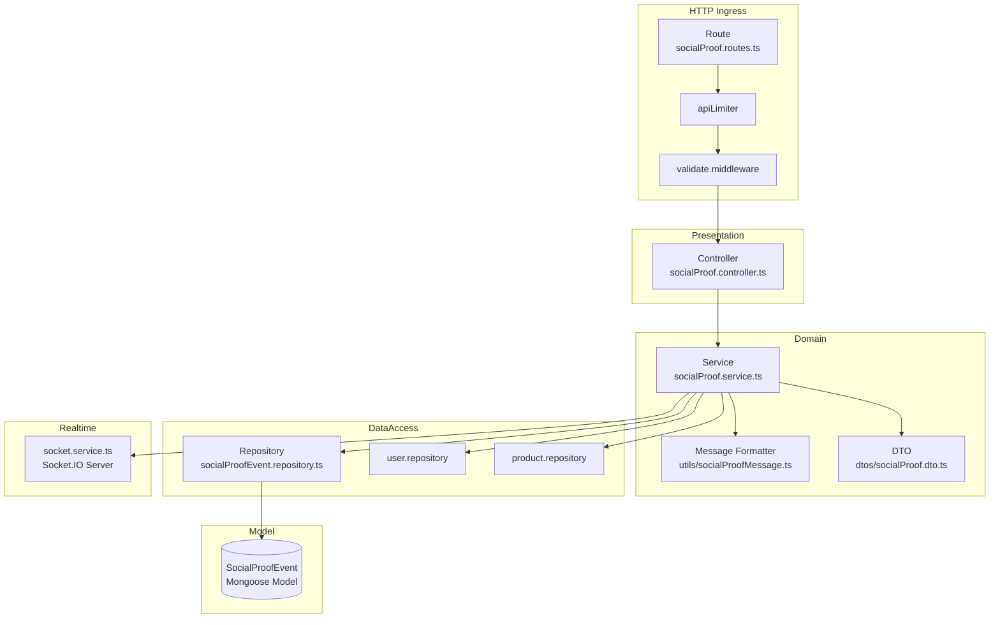
```mermaid
flowchart TB
    subgraph HTTP[HTTP Ingress]
        R[Route<br/>socialProof.routes.ts]
        V[validate.middleware]
        RL[apiLimiter]
    end

    subgraph Presentation
        C[Controller<br/>socialProof.controller.ts]
    end

    subgraph Domain
        S[Service<br/>socialProof.service.ts]
        MSG[Message Formatter<br/>utils/socialProofMessage.ts]
        DTO[DTO<br/>dtos/socialProof.dto.ts]
    end

    subgraph DataAccess
        REPO[Repository<br/>socialProofEvent.repository.ts]
        REPO_USER[user.repository]
        REPO_PROD[product.repository]
    end

    subgraph Model
        M[(SocialProofEvent<br/>Mongoose Model)]
    end

    subgraph Realtime
        SOCK[socket.service.ts<br/>Socket.IO Server]
    end

    R --> RL --> V --> C
    C --> S
    S --> MSG
    S --> DTO
    S --> REPO
    S --> REPO_USER
    S --> REPO_PROD
    S --> SOCK
    REPO --> M
```

### 3.2 Request Flow (Read)

1. HTTP request hits `apiLimiter` (global rate limiter).
2. Route delegates to `validate(getRecentEventsSchema)` middleware.
3. Validated request enters the controller.
4. Controller invokes the service function.
5. Service calls the repository (`.lean()` reads for speed).
6. Service maps entities → DTO via the message formatter.
7. Controller wraps DTO in `ApiResponse` and returns HTTP 200.

### 3.3 Event Flow (Write / Broadcast)

Producer services call the pure function [`trackEvent()`](../src/services/socialProof.service.ts). The function is designed as a **fire-and-forget side-effect** from the producer's perspective — its failures must never propagate.

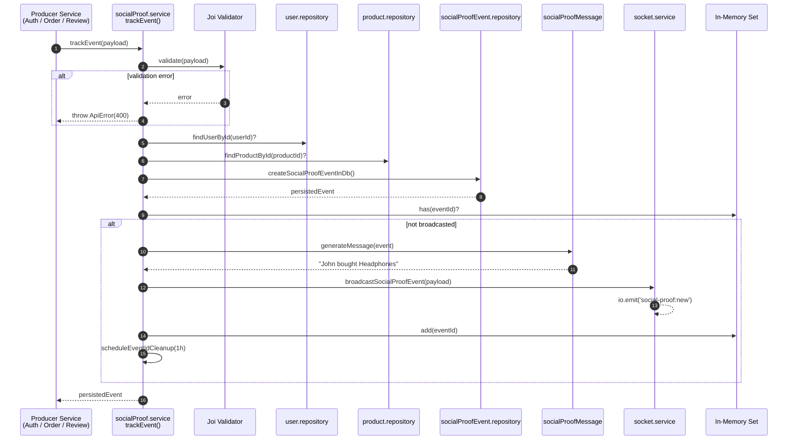
```mermaid
sequenceDiagram
    autonumber
    participant PROD as Producer Service<br/>(Auth / Order / Review)
    participant SVC as socialProof.service<br/>trackEvent()
    participant JOI as Joi Validator
    participant UREPO as user.repository
    participant PREPO as product.repository
    participant REPO as socialProofEvent.repository
    participant MSG as socialProofMessage
    participant SOCK as socket.service
    participant DEDUP as In-Memory Set

    PROD->>SVC: trackEvent(payload)
    SVC->>JOI: validate(payload)
    alt validation error
        JOI-->>SVC: error
        SVC-->>PROD: throw ApiError(400)
    end
    SVC->>UREPO: findUserById(userId)?
    SVC->>PREPO: findProductById(productId)?
    SVC->>REPO: createSocialProofEventInDb()
    REPO-->>SVC: persistedEvent
    SVC->>DEDUP: has(eventId)?
    alt not broadcasted
        SVC->>MSG: generateMessage(event)
        MSG-->>SVC: "John bought Headphones"
        SVC->>SOCK: broadcastSocialProofEvent(payload)
        SOCK-->>SOCK: io.emit('social-proof:new')
        SVC->>DEDUP: add(eventId)
        SVC->>SVC: scheduleEventIdCleanup(1h)
    end
    SVC-->>PROD: persistedEvent
```

### 3.4 Dependency Flow

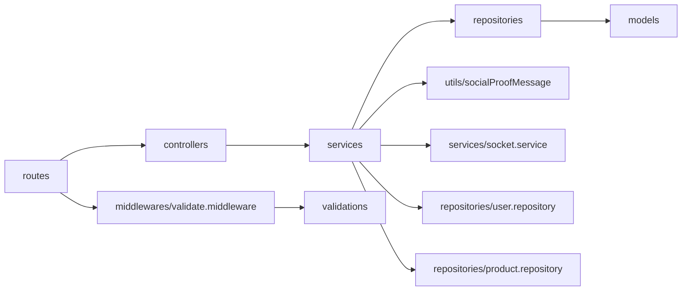
```mermaid
graph LR
    controllers --> services
    services --> repositories
    services --> utils_msg[utils/socialProofMessage]
    services --> socket[services/socket.service]
    services --> repo_user[repositories/user.repository]
    services --> repo_prod[repositories/product.repository]
    repositories --> models
    routes --> controllers
    routes --> validate[middlewares/validate.middleware]
    validate --> validations
```

---

## 4. Folder Structure

Social Proof is currently implemented as **layer-per-directory** (not a self-contained module). The following table lists every file that participates in the feature and its responsibility.

```
FesShop/
├── src/
│   ├── routes/
│   │   └── socialProof.routes.ts          # HTTP route definitions
│   ├── controllers/
│   │   └── socialProof.controller.ts      # HTTP request/response handlers
│   ├── services/
│   │   ├── socialProof.service.ts         # Business logic + orchestration
│   │   └── socket.service.ts              # Socket.IO singleton + broadcaster
│   ├── repositories/
│   │   └── socialProofEvent.repository.ts # Mongo data access
│   ├── models/
│   │   └── socialProofEvent.model.ts      # Mongoose schema + enum
│   ├── dtos/
│   │   └── socialProof.dto.ts             # RecentSocialProofEventDto, MetricsDto
│   ├── validations/
│   │   └── socialProof.validation.ts      # Joi schemas
│   ├── utils/
│   │   └── socialProofMessage.ts          # Event → user-facing message
│   └── server.ts                          # HTTP + Socket.IO bootstrap
└── docs/
    └── SOCIALPROOF_BACKEND_TECHNICAL_DOCUMENT.md   # this file
```

### 4.1 Recommended Module-Style Layout (Future Refactor)

For long-term maintainability the module can be co-located under `src/modules/social-proof/`. This layout is **not yet applied** but is recommended:

```
src/modules/social-proof/
├── controllers/    # HTTP handlers
├── routes/         # Express routers
├── services/       # Domain services (trackEvent, metrics)
├── repositories/   # Mongo access
├── models/         # Mongoose schemas
├── validators/     # Joi schemas
├── sockets/        # Socket handlers, room registry
├── dto/            # Request/response contracts
├── events/         # Internal event enum + domain events
├── utils/          # Message formatters, helpers
└── constants/      # Channel names, cleanup delays, defaults
```

### 4.2 Directory Responsibilities

| Directory | Responsibility |
|---|---|
| `controllers/` | Parse HTTP request → call service → wrap result in `ApiResponse`. **No business logic.** |
| `routes/` | Bind URLs to controllers and attach middleware (validate, rate-limit). |
| `services/` | All business rules, orchestration between repositories, transactional side-effects. |
| `repositories/` | Only Mongoose queries. **Never** import controllers/services. |
| `models/` | Mongoose schemas, indexes, virtuals, hooks. |
| `validators/` (`validations/`) | Joi schemas describing the shape of inputs. |
| `sockets/` (`services/socket.service.ts`) | Socket.IO server lifecycle + typed broadcasters. |
| `dto/` (`dtos/`) | Serialization contracts sent to clients (with Swagger annotations). |
| `utils/` | Pure functions (e.g. message formatting) — no I/O. |

---

## 5. Authentication & Authorization

### 5.1 Endpoint Access Matrix

| Endpoint | Auth | Rationale |
|---|---|---|
| `GET /api/social-proof/recent` | **Public** | Data is intentionally public — it *is* social proof. |
| `GET /api/social-proof/metrics` | **Public** | Aggregated counters expose no PII. |
| Internal `trackEvent(...)` | N/A (in-process) | Only invoked by internal services; not reachable over HTTP. |
| Socket.IO namespace `/` | **Public** (currently) | Anonymous clients may subscribe to `social-proof:new`. Recommended to gate via JWT — see §5.4. |

### 5.2 Middleware Chain

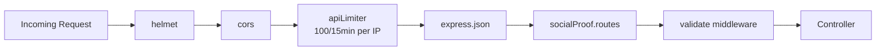
```mermaid
flowchart LR
    REQ[Incoming Request] --> HELMET[helmet]
    HELMET --> CORS[cors]
    CORS --> RATE[apiLimiter<br/>100/15min per IP]
    RATE --> JSON[express.json]
    JSON --> ROUTE[socialProof.routes]
    ROUTE --> VALIDATE[validate middleware]
    VALIDATE --> CTRL[Controller]
```

### 5.3 JWT Validation for Producer Flows

Producer endpoints (auth register, order create, review create) already require JWT via their own routes. When these controllers invoke `trackEvent()`, the caller identity has already been established upstream — the Social Proof service **trusts the internal call**.

### 5.4 Recommended Socket Authentication (Future Hardening)

Currently the Socket.IO handshake is open. The recommended hardening is:

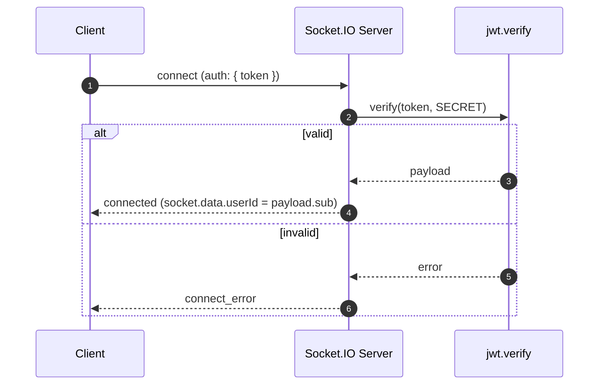
```mermaid
sequenceDiagram
    autonumber
    participant C as Client
    participant SIO as Socket.IO Server
    participant JWT as jwt.verify

    C->>SIO: connect (auth: { token })
    SIO->>JWT: verify(token, SECRET)
    alt valid
        JWT-->>SIO: payload
        SIO-->>C: connected (socket.data.userId = payload.sub)
    else invalid
        JWT-->>SIO: error
        SIO-->>C: connect_error
    end
```

Implementation sketch (not currently in code):

```ts
io.use((socket, next) => {
  const token = socket.handshake.auth?.token;
  try { socket.data.user = jwt.verify(token, process.env.JWT_SECRET!); next(); }
  catch (e) { next(new Error('unauthorized')); }
});
```

---

## 6. ActiveFeeds Backend

The **ActiveFeeds** capability is the read side of Social Proof: it exposes recent events for chronological rendering by the client.

### 6.1 Feature Overview

`GET /api/social-proof/recent` returns up to `limit` most-recent events, sorted by `createdAt` descending, formatted as `RecentSocialProofEventDto`.

### 6.2 Business Logic

1. Validate `limit` (integer, 1–100, default 10).
2. Load recent documents from Mongo using `find().sort({createdAt: -1}).limit(N).lean()`.
3. Map each document to a DTO using the [message formatter](../src/utils/socialProofMessage.ts) so the caller receives already-formatted, i18n-ready messages.
4. Return the DTO array wrapped in `ApiResponse`.

### 6.3 Feed CRUD Semantics

| Operation | Supported? | Notes |
|---|---|---|
| Create | Yes (internal only) | Via `trackEvent()` — never exposed as HTTP. |
| Read | Yes | `GET /recent` (public). |
| Update | **No** | Events are immutable by design. Modifying history would falsify social proof. |
| Delete | **No** | Events are append-only. TTL/archival can be layered later (see §17). |

### 6.4 Pagination, Filtering, Sorting

| Concern | Current Behaviour | Notes |
|---|---|---|
| Pagination | Simple `limit` (1–100), no cursor | Adequate for a live feed. Offset pagination not needed. |
| Sorting | Fixed `createdAt DESC` | Sorted via index on `createdAt`. |
| Filtering by type | **Not exposed** | Available at repository level via `type` index — extension point. |
| Search | Not applicable | Feed is chronological, not text-searchable. |

### 6.5 Feed Ranking

Feed ordering is **strictly chronological** — no personalized ranking is applied. This is a conscious design decision: social-proof value comes from *freshness*, and personalized ranking would introduce bias.

### 6.6 Feed Retrieval Flow

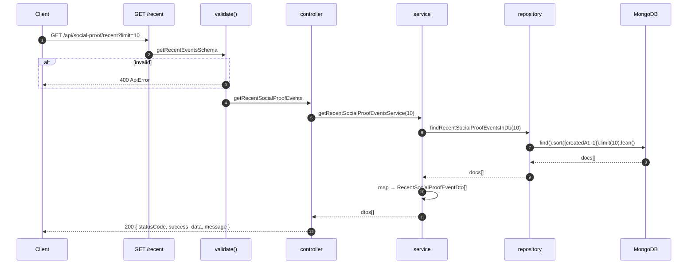
```mermaid
sequenceDiagram
    autonumber
    participant Client
    participant Route as GET /recent
    participant Val as validate()
    participant Ctrl as controller
    participant Svc as service
    participant Repo as repository
    participant Mongo as MongoDB

    Client->>Route: GET /api/social-proof/recent?limit=10
    Route->>Val: getRecentEventsSchema
    alt invalid
        Val-->>Client: 400 ApiError
    end
    Val->>Ctrl: getRecentSocialProofEvents
    Ctrl->>Svc: getRecentSocialProofEventsService(10)
    Svc->>Repo: findRecentSocialProofEventsInDb(10)
    Repo->>Mongo: find().sort({createdAt:-1}).limit(10).lean()
    Mongo-->>Repo: docs[]
    Repo-->>Svc: docs[]
    Svc->>Svc: map → RecentSocialProofEventDto[]
    Svc-->>Ctrl: dtos[]
    Ctrl-->>Client: 200 { statusCode, success, data, message }
```

### 6.7 Feed Creation Flow (Internal)

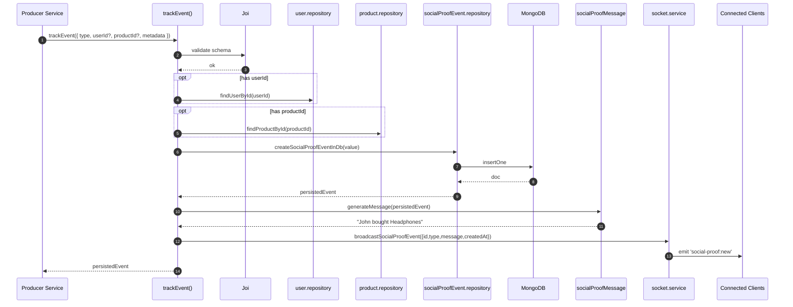
```mermaid
sequenceDiagram
    autonumber
    participant Producer as Producer Service
    participant Svc as trackEvent()
    participant Val as Joi
    participant U as user.repository
    participant P as product.repository
    participant Repo as socialProofEvent.repository
    participant Mongo as MongoDB
    participant Msg as socialProofMessage
    participant Sock as socket.service
    participant Clients as Connected Clients

    Producer->>Svc: trackEvent({ type, userId?, productId?, metadata })
    Svc->>Val: validate schema
    Val-->>Svc: ok
    opt has userId
        Svc->>U: findUserById(userId)
    end
    opt has productId
        Svc->>P: findProductById(productId)
    end
    Svc->>Repo: createSocialProofEventInDb(value)
    Repo->>Mongo: insertOne
    Mongo-->>Repo: doc
    Repo-->>Svc: persistedEvent
    Svc->>Msg: generateMessage(persistedEvent)
    Msg-->>Svc: "John bought Headphones"
    Svc->>Sock: broadcastSocialProofEvent({id,type,message,createdAt})
    Sock->>Clients: emit 'social-proof:new'
    Svc-->>Producer: persistedEvent
```

### 6.8 Transactions

`trackEvent()` performs a **single write** (`SocialProofEvent.create`) and does not require a multi-document transaction. Reference-integrity checks against `User` and `Product` are read-only pre-flight checks — they are **not** atomic with the insert. This trade-off is acceptable because:

- Events are append-only and idempotent per producer trigger.
- Loss of the reference before broadcast would just produce a "Someone" message.

### 6.9 Error Handling

| Failure Point | Behaviour |
|---|---|
| Joi validation | Throws `ApiError(400)` → producer catches and logs; does NOT block producer flow. |
| Missing referenced user/product | Throws `ApiError(400)` |
| Mongo insert error | Logged; safely re-thrown as `ApiError(500, "Failed to persist social proof event")` |
| Broadcast error | Caught internally, logged, **never** rethrown. Persistence result still returned. |

### 6.10 Performance Optimization

- `.lean()` reads bypass Mongoose hydration → ~3–5× faster reads.
- Index `{ createdAt: -1 }` serves the primary read pattern directly.
- Parallel aggregation via `Promise.all` in metrics service.
- No N+1: the message formatter is pure and requires no additional queries — user/product names are captured in `metadata` at write-time (see `order.service.ts` snapshot pattern).

### 6.11 Cache Strategy

Currently **no cache** sits in front of `/recent`. Recommended future strategy in §13.

---

## 7. Metric APIs

### 7.1 Purpose

Expose a lightweight, aggregated snapshot of platform activity for **today** (UTC-based):

- `signupsToday`
- `purchasesToday`
- `reviewsToday`
- `activeUsers` (distinct `userId` across all today's events)

### 7.2 Business Logic

The service computes today's `[startOfDay, endOfDay]` UTC boundaries, then dispatches **four parallel repository queries**:

```ts
const [signups, purchases, reviews, active] = await Promise.all([
  countEventsByTypeInDateRange(SIGNUP, start, end),
  countEventsByTypeInDateRange(PURCHASE, start, end),
  countEventsByTypeInDateRange(REVIEW, start, end),
  countDistinctActiveUsersInDateRange(start, end),
]);
```

The controller then remaps internal names → API DTO:

| Internal (`SocialProofMetrics`) | API DTO (`SocialProofMetricsDto`) |
|---|---|
| `totalSignupsToday` | `signupsToday` |
| `totalPurchasesToday` | `purchasesToday` |
| `totalReviewsToday` | `reviewsToday` |
| `activeUsersCount` | `activeUsers` |

This indirection **decouples the API contract from the internal metric shape**, allowing future internal enrichment without breaking clients.

### 7.3 Metric Aggregation Flow

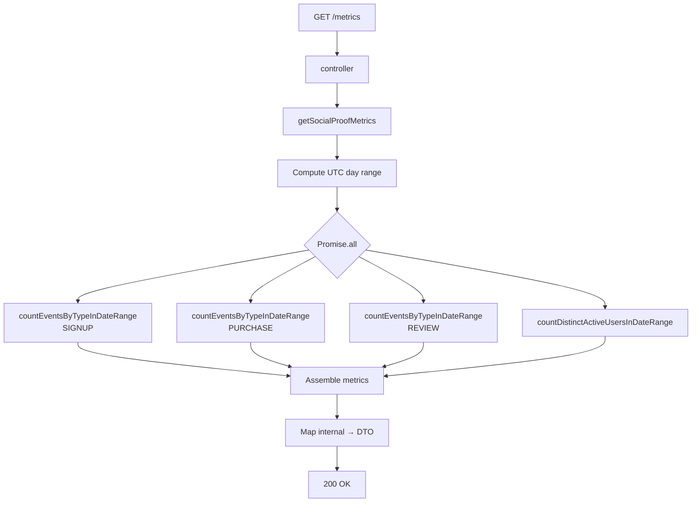
```mermaid
flowchart TD
    A[GET /metrics] --> B[controller]
    B --> C[getSocialProofMetrics]
    C --> D[Compute UTC day range]
    D --> E{Promise.all}
    E --> F1[countEventsByTypeInDateRange<br/>SIGNUP]
    E --> F2[countEventsByTypeInDateRange<br/>PURCHASE]
    E --> F3[countEventsByTypeInDateRange<br/>REVIEW]
    E --> F4[countDistinctActiveUsersInDateRange]
    F1 --> G[Assemble metrics]
    F2 --> G
    F3 --> G
    F4 --> G
    G --> H[Map internal → DTO]
    H --> I[200 OK]
```

### 7.4 Query Optimization

- **`countDocuments`** is served by the compound index `{ type: 1, createdAt: -1 }` — no collection scan.
- **Distinct active users** uses `$match` (indexed) → `$group` → `$count`. Filtering by `createdAt` first reduces the group set to today's activity only.
- All four queries execute in parallel, dominating latency by the slowest single query rather than their sum.

### 7.5 Response Model

```json
{
  "statusCode": 200,
  "success": true,
  "message": "Social proof metrics fetched successfully",
  "data": {
    "signupsToday": 25,
    "purchasesToday": 8,
    "reviewsToday": 12,
    "activeUsers": 102
  }
}
```

### 7.6 Error Handling

- Any repository failure is wrapped as `ApiError(500, "Failed to retrieve social proof metrics")`.
- Internal Mongo error details are **not** returned to the client (avoid leaking schema info).

### 7.7 Cache Strategy (Recommended)

Since metrics change slowly (updated as events arrive) and are read very frequently, a short-lived cache is ideal:

- **Key**: `sp:metrics:YYYY-MM-DD`
- **TTL**: 30–60 s
- **Invalidation**: TTL-only (no proactive purge — small drift is acceptable for a social-proof widget).

---

## 8. Socket Communication

### 8.1 Architecture

The Socket.IO server is a **singleton** created once during bootstrap in [`server.ts`](../src/server.ts) via [`initializeSocket()`](../src/services/socket.service.ts). All services obtain the broadcaster indirectly by calling the exported function `broadcastSocialProofEvent()` — they do **not** import the `io` instance directly, keeping producers loosely coupled.

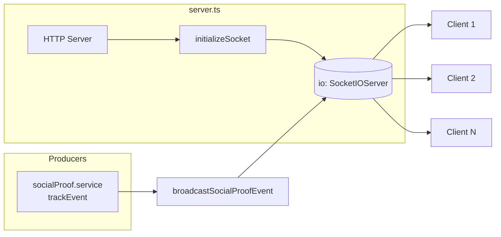
```mermaid
flowchart LR
    subgraph Bootstrap[server.ts]
        HTTP[HTTP Server] --> INIT[initializeSocket]
        INIT --> IO[(io: SocketIOServer)]
    end

    subgraph Producers
        SVC[socialProof.service<br/>trackEvent]
    end

    SVC --> BROAD[broadcastSocialProofEvent]
    BROAD --> IO
    IO --> C1[Client 1]
    IO --> C2[Client 2]
    IO --> CN[Client N]
```

### 8.2 Connection Lifecycle

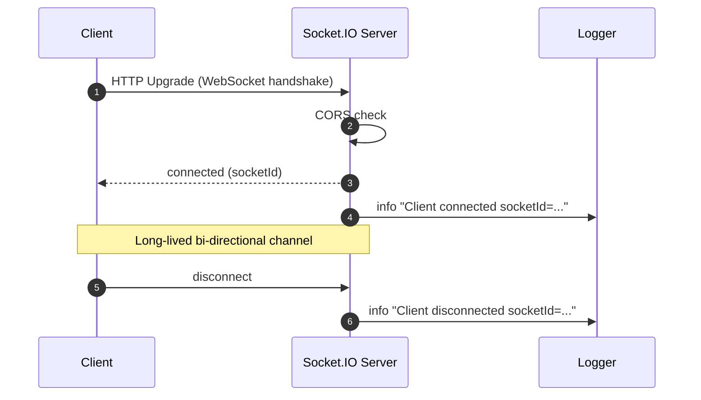
```mermaid
sequenceDiagram
    autonumber
    participant C as Client
    participant IO as Socket.IO Server
    participant LOG as Logger

    C->>IO: HTTP Upgrade (WebSocket handshake)
    IO->>IO: CORS check
    IO-->>C: connected (socketId)
    IO->>LOG: info "Client connected socketId=..."
    Note over C,IO: Long-lived bi-directional channel
    C->>IO: disconnect
    IO->>LOG: info "Client disconnected socketId=..."
```

### 8.3 Authentication (Current State)

Currently the connection is **open** (no JWT check on the handshake). See §5.4 for the recommended `io.use()` middleware to gate connections with JWT.

### 8.4 Event Subscriptions & Publishing

Only **one** business event is emitted on the default namespace:

- **`social-proof:new`** — server → all clients

Clients do not emit anything back today. Any client-to-server upstream events (e.g. `subscribe` to a room) are reserved for future extensions.

### 8.5 Rooms & Namespaces

- **Namespace:** default (`/`).
- **Rooms:** none currently. Recommended future rooms:
  - `product:<productId>` — for product-page live activity.
  - `user:<userId>` — for personalised notifications.

### 8.6 Live Feed Update Flow

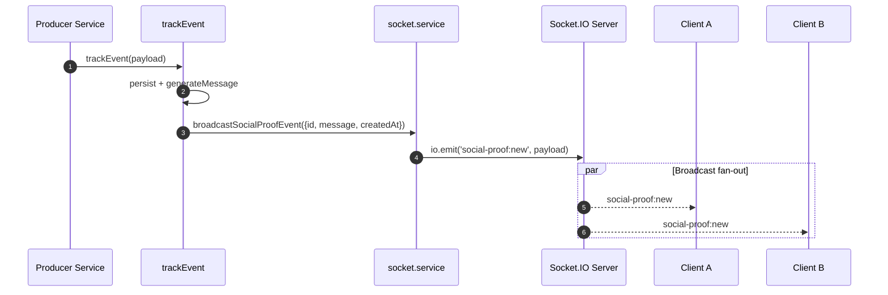
```mermaid
sequenceDiagram
    autonumber
    participant PROD as Producer Service
    participant SVC as trackEvent
    participant SOCK as socket.service
    participant IO as Socket.IO Server
    participant C1 as Client A
    participant C2 as Client B

    PROD->>SVC: trackEvent(payload)
    SVC->>SVC: persist + generateMessage
    SVC->>SOCK: broadcastSocialProofEvent({id, message, createdAt})
    SOCK->>IO: io.emit('social-proof:new', payload)
    par Broadcast fan-out
        IO-->>C1: social-proof:new
        IO-->>C2: social-proof:new
    end
```

### 8.7 Redis Adapter (Recommended for Multi-Instance Deployment)

Single-process `io.emit` does **not** reach clients connected to a different node. For horizontal scaling:

```ts
import { createAdapter } from '@socket.io/redis-adapter';
import { createClient } from 'redis';
const pub = createClient({ url: process.env.REDIS_URL });
const sub = pub.duplicate();
await Promise.all([pub.connect(), sub.connect()]);
io.adapter(createAdapter(pub, sub));
```

### 8.8 Error Handling

- `broadcastSocialProofEvent` **always** catches its own errors and logs them — the producer flow is never affected.
- Missing `io` instance (called before init) logs a warning and returns.

### 8.9 Reconnection Strategy

Socket.IO client library handles reconnection automatically (exponential backoff, up to `reconnectionAttempts`). No custom server-side logic is needed. On reconnect the client should call `GET /recent` to backfill missed events.

### 8.10 Event Reference Table

| Event Name | Namespace | Direction | Payload | Trigger | Response | Description |
|---|---|---|---|---|---|---|
| `connect` | `/` | client → server | none | Client opens socket | Server logs connection, no ACK | Handshake |
| `disconnect` | `/` | client → server | none | Client closes | Server logs disconnect | Cleanup |
| `social-proof:new` | `/` | server → client | `{ id: string, type: string, message: string, createdAt: Date }` | Successful `trackEvent()` persistence | None (broadcast, no ACK) | Live activity feed update |
| `connect_error` | `/` | server → client | `Error` | Handshake failure (e.g. future JWT rejection) | Client should not retry auth failures | Auth / CORS failure |

---

## 9. Database Design

### 9.1 Collection: `social_proof_events` (Mongoose model `SocialProofEvent`)

| Field | Type | Required | Default | Description |
|---|---|---|---|---|
| `_id` | `ObjectId` | yes | auto | Primary key. |
| `type` | `String` (enum) | yes | — | One of `PURCHASE`, `SIGNUP`, `REVIEW`, `VIEW`, `ONLINE_USER`. |
| `userId` | `ObjectId` (ref: `User`) | no | — | Optional actor. Null for anonymous/guest events. |
| `productId` | `ObjectId` (ref: `Product`) | no | — | Optional product context. Null for non-product events (e.g. SIGNUP). |
| `metadata` | `Mixed` | no | `{}` | Free-form snapshot (name, productName, rating, amount, etc.). |
| `createdAt` | `Date` | auto | `Date.now` | Timestamp added by `{ timestamps: true }`. |
| `updatedAt` | `Date` | auto | `Date.now` | Present for schema symmetry — events are immutable. |

### 9.2 Enum: `SocialProofEventType`

```ts
enum SocialProofEventType {
  PURCHASE     = "PURCHASE",
  SIGNUP       = "SIGNUP",
  REVIEW       = "REVIEW",
  VIEW         = "VIEW",
  ONLINE_USER  = "ONLINE_USER",
}
```

### 9.3 Indexes

| Name | Definition | Query Pattern Served |
|---|---|---|
| `createdAt_-1` | `{ createdAt: -1 }` | Recent feed retrieval, TTL/archival scans. |
| `productId_1` | `{ productId: 1 }` | Product-level filters. |
| `userId_1` | `{ userId: 1 }` | User activity lookups. |
| `type_1` | `{ type: 1 }` | Type-based filters. |
| `productId_1_type_1_createdAt_-1` | `{ productId: 1, type: 1, createdAt: -1 }` | "Recent PURCHASE events for product X". |
| **Recommended add** | `{ type: 1, createdAt: -1 }` | Serves `countEventsByTypeInDateRange` — see §17. |

### 9.4 Constraints

- `type` is constrained to the enum via Mongoose validation.
- `userId` / `productId` are `ObjectId` — pattern-validated at the Joi layer.
- Events are **append-only**: no update path in the codebase, no soft-delete (see §9.5).

### 9.5 Audit & Soft Delete

| Concern | Current | Recommendation |
|---|---|---|
| Audit fields | `createdAt`, `updatedAt` (auto) | Sufficient — events are immutable. |
| Soft delete | None | Not needed. If required by regulation (GDPR "right to be forgotten"), delete by `userId` rather than flag. |
| Retention | None | Add a TTL index `{ createdAt: 1 }` with `expireAfterSeconds: 90*24*3600` for 90-day retention. |

### 9.6 ER Diagram

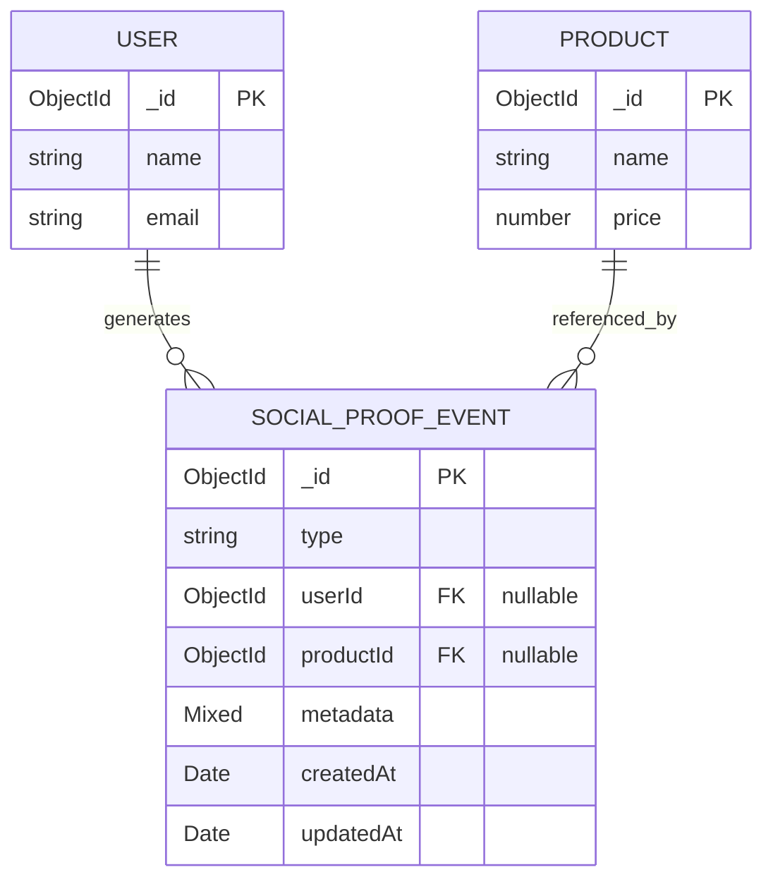
```mermaid
erDiagram
    USER ||--o{ SOCIAL_PROOF_EVENT : generates
    PRODUCT ||--o{ SOCIAL_PROOF_EVENT : referenced_by

    USER {
        ObjectId _id PK
        string name
        string email
    }
    PRODUCT {
        ObjectId _id PK
        string name
        number price
    }
    SOCIAL_PROOF_EVENT {
        ObjectId _id PK
        string type
        ObjectId userId FK "nullable"
        ObjectId productId FK "nullable"
        Mixed metadata
        Date createdAt
        Date updatedAt
    }
```

### 9.7 Example Documents

**SIGNUP event**
```json
{
  "_id": "652a2b2e8c1d2f3a4b5c6d7e",
  "type": "SIGNUP",
  "userId": "652a2b2e8c1d2f3a4b5c6d7f",
  "metadata": { "name": "John Doe", "email": "john@example.com" },
  "createdAt": "2026-07-07T10:30:00.000Z",
  "updatedAt": "2026-07-07T10:30:00.000Z"
}
```

**PURCHASE event**
```json
{
  "_id": "652a2b2e8c1d2f3a4b5c6d80",
  "type": "PURCHASE",
  "userId": "652a2b2e8c1d2f3a4b5c6d81",
  "productId": "652a2b2e8c1d2f3a4b5c6d82",
  "metadata": {
    "orderId": "652a2b2e8c1d2f3a4b5c6d83",
    "productName": "Wireless Headphones",
    "quantity": 1,
    "price": 129.99,
    "totalAmount": 129.99,
    "paymentMethod": "CARD",
    "userName": "Jane Smith"
  },
  "createdAt": "2026-07-07T10:35:00.000Z",
  "updatedAt": "2026-07-07T10:35:00.000Z"
}
```

---

## 10. API Documentation

Base path: `/api/social-proof`

### 10.1 `GET /api/social-proof/recent`

| | |
|---|---|
| **Endpoint** | `getRecentSocialProofEvents` |
| **Method** | `GET` |
| **URL** | `/api/social-proof/recent` |
| **Auth** | Public |
| **Rate Limit** | Global `apiLimiter` (100 req / 15 min / IP) |

**Query Parameters**

| Name | Type | Required | Default | Rules |
|---|---|---|---|---|
| `limit` | integer | no | 10 | Min 1, Max 100 |

**Success Response — `200 OK`**

```json
{
  "statusCode": 200,
  "success": true,
  "message": "Recent social proof events fetched successfully",
  "data": [
    {
      "id": "652a2b2e8c1d2f3a4b5c6d7e",
      "message": "John Doe joined recently",
      "createdAt": "2026-07-07T10:30:00.000Z"
    }
  ]
}
```

**Error Responses**

| Code | When | Body |
|---|---|---|
| 400 | Invalid `limit` (not integer, out of range) | `ApiError` with Joi details |
| 429 | Rate limit exceeded | `{ success: false, message: "Too many requests..." }` |
| 500 | Unhandled server error | `ApiError(500, "Internal Server Error")` |

**Sample Request**
```http
GET /api/social-proof/recent?limit=20 HTTP/1.1
Host: localhost:3000
Accept: application/json
```

---

### 10.2 `GET /api/social-proof/metrics`

| | |
|---|---|
| **Endpoint** | `getSocialProofMetricsController` |
| **Method** | `GET` |
| **URL** | `/api/social-proof/metrics` |
| **Auth** | Public |
| **Rate Limit** | Global `apiLimiter` |

**Parameters** — None.

**Success Response — `200 OK`**

```json
{
  "statusCode": 200,
  "success": true,
  "message": "Social proof metrics fetched successfully",
  "data": {
    "signupsToday": 25,
    "purchasesToday": 8,
    "reviewsToday": 12,
    "activeUsers": 102
  }
}
```

**Error Responses**

| Code | When |
|---|---|
| 429 | Rate limit exceeded |
| 500 | Aggregation failure (Mongo down, timeout) |

---

### 10.3 Internal API: `trackEvent(payload)`

Not an HTTP endpoint. Exposed at the service layer to be called by producer flows.

**Payload Schema (Joi)**

| Field | Type | Required | Rules |
|---|---|---|---|
| `type` | string | yes | Must be one of `SocialProofEventType` |
| `userId` | string | no | Must match `^[0-9a-fA-F]{24}$` and exist in `users` |
| `productId` | string | no | Must match `^[0-9a-fA-F]{24}$` and exist in `products` |
| `metadata` | object | no | Free-form (default `{}`) |

**Returns:** `Promise<ISocialProofEvent>` (the persisted document).

**Throws:** `ApiError(400)` on validation / reference failure; `ApiError(500)` on persistence failure.

---

## 11. Repository Layer

### 11.1 Pattern

The repository is a thin, **stateless module of pure Mongoose calls**. It does not depend on Express, controllers, or the message formatter — enabling reuse from jobs, tests, or migrations.

### 11.2 Public Functions

| Function | Signature | Purpose |
|---|---|---|
| `createSocialProofEventInDb` | `(data: Partial<ISocialProofEvent>) → Promise<ISocialProofEvent>` | Insert a new event. |
| `findRecentSocialProofEventsInDb` | `(limit: number) → Promise<ISocialProofEvent[]>` | Newest-first list (`.lean()`). |
| `countEventsByTypeInDateRange` | `(type, start, end) → Promise<number>` | Count events of a type within a window. |
| `countDistinctActiveUsersInDateRange` | `(start, end) → Promise<number>` | Distinct user count via aggregation. |

### 11.3 Aggregation Pipeline (active users)

```js
[
  { $match: { createdAt: { $gte: start, $lte: end }, userId: { $ne: null } } },
  { $group: { _id: "$userId" } },
  { $count: "activeUsers" }
]
```

Design rationale:

- `$match` first → uses `{ createdAt: -1 }` index → smallest working set for `$group`.
- `$ne: null` excludes anonymous events — active users must be identifiable.
- `$count` returns a single-element array; the caller returns `0` when empty.

### 11.4 Bulk Operations

Not used today. If migrations become necessary (e.g. denormalising `productName` into `metadata`), `bulkWrite` with `updateMany` operations is the recommended approach.

### 11.5 Transactions

The repository does **not** wrap operations in transactions. `SocialProofEvent.create` is a single-document write which is atomic in MongoDB by default. If future features write to multiple collections (e.g. Social Proof + notification queue), a `session.withTransaction()` block should be introduced at the service layer.

### 11.6 Query Optimization Summary

| Query | Executed Plan | Index Used |
|---|---|---|
| `find().sort({createdAt:-1}).limit(n).lean()` | IXSCAN + LIMIT | `createdAt_-1` |
| `countDocuments({type, createdAt:{...}})` | IXSCAN | `type_1_createdAt_-1` (recommended add) |
| Distinct users aggregation | IXSCAN → GROUP | `createdAt_-1` + `userId_1` |

---

## 12. Validation

### 12.1 Library

**Joi ^18** — chosen for expressive rules, automatic error aggregation, and default values.

### 12.2 Validators

#### `trackEventSchema` — internal `trackEvent()` payloads

```ts
{
  type: Joi.string().valid(...Object.values(SocialProofEventType)).required(),
  userId: objectId.optional(),
  productId: objectId.optional(),
  metadata: Joi.object().unknown(true).optional().default({}),
}
```

- `objectId` = `Joi.string().pattern(/^[0-9a-fA-F]{24}$/)` — enforces MongoDB ObjectId shape.
- Validation runs inside `trackEvent()` with `abortEarly: false, stripUnknown: true`.

#### `getRecentEventsSchema` — HTTP query params

```ts
{
  query: Joi.object({
    limit: Joi.number().integer().min(1).max(100).default(10).optional()
  })
}
```

Wired via `validate(getRecentEventsSchema)` in `socialProof.routes.ts`.

### 12.3 DTOs

DTOs live in [`dtos/socialProof.dto.ts`](../src/dtos/socialProof.dto.ts) and are only used as **response contracts** (TypeScript interfaces + Swagger annotations). Request-shaping is handled by Joi.

| DTO | Fields |
|---|---|
| `RecentSocialProofEventDto` | `id: string`, `message: string`, `createdAt: Date` |
| `SocialProofMetricsDto` | `signupsToday`, `purchasesToday`, `reviewsToday`, `activeUsers` (all `number`) |

### 12.4 Error Response Shape

Validation failures are rethrown through the global error middleware as:

```json
{
  "statusCode": 400,
  "success": false,
  "message": "Type is required, Limit must be at least 1",
  "errors": [ /* Joi.details[] */ ]
}
```

---

## 13. Caching

### 13.1 Current State

**No caching is applied** in the Social Proof feature today. All reads hit MongoDB directly. This is acceptable for the current traffic profile but is the first optimisation to introduce as load grows.

### 13.2 Recommended Redis Layout

| Cache Key | TTL | Invalidation | Purpose |
|---|---|---|---|
| `sp:recent:limit=<n>` | 5–10 s | TTL only | Absorb burst reads on `/recent`. |
| `sp:metrics:<YYYY-MM-DD>` | 30–60 s | TTL only | Reduce four aggregation queries to one Redis GET. |
| `sp:dedup:<eventId>` | 3600 s (SETEX) | TTL only | **Multi-instance** replacement for the in-memory dedup Set. |

### 13.3 Update Strategy

- **Read-through**: check Redis first, fall back to Mongo, populate on miss.
- **Write side**: `trackEvent` may proactively invalidate `sp:metrics:<today>` after insert to prevent staleness for privileged internal viewers, or rely on the short TTL for simplicity.

### 13.4 Broadcast Dedup Migration to Redis

The in-process `broadcastedEventIds` Set only works on a single instance. Moving to Redis:

```ts
const key = `sp:dedup:${eventId}`;
const ok = await redis.set(key, '1', 'EX', 3600, 'NX');
if (ok !== 'OK') return;   // already broadcasted from another node
broadcastSocialProofEvent(payload);
```

---

## 14. Error Handling

### 14.1 Error Categories

| Category | Where Raised | HTTP Code | Client-Facing? |
|---|---|---|---|
| Validation (Joi) | Middleware or service | 400 | Yes (message + details) |
| Reference not found (userId / productId) | Service | 400 | Yes |
| Rate-limit | Middleware | 429 | Yes |
| Persistence (Mongo write error) | Service | 500 | Sanitised — "Failed to persist social proof event" |
| Aggregation (metrics failure) | Service | 500 | Sanitised — "Failed to retrieve social proof metrics" |
| Broadcast failure | Socket service | — | **Never** — swallowed + logged |
| Unexpected exception | Global error middleware | 500 | Sanitised |

### 14.2 Error Response Contract

All errors leave the API in a consistent shape via the global `errorHandler` middleware:

```json
{
  "statusCode": 400,
  "success": false,
  "message": "Type is required",
  "errors": [{ "path": ["type"], "message": "Type is required" }]
}
```

### 14.3 Producer-Safe Failure Semantics

The single most important rule for Social Proof:

> **A Social Proof failure MUST NOT fail the originating business flow.**

This is enforced in every producer:

```ts
try {
  await trackEvent({ ... });
} catch (socialProofErr) {
  logger.error(`[SocialProof] ... failed - Error: ${socialProofErr.message}`);
  // swallowed — order/review/signup continues
}
```

Similarly, `broadcastSocialProofEvent()` **wraps its emit in try/catch** and only logs — never throws.

### 14.4 Retry Strategy

- **Persistence**: not retried in-process (Mongo failures indicate real trouble; retrying would double-write on partial failure).
- **Broadcast**: not retried (clients will backfill via `GET /recent` on next open/reconnect).
- **Metrics read**: no retry (client can re-poll).

### 14.5 Retry Flow (Client-Driven Backfill)

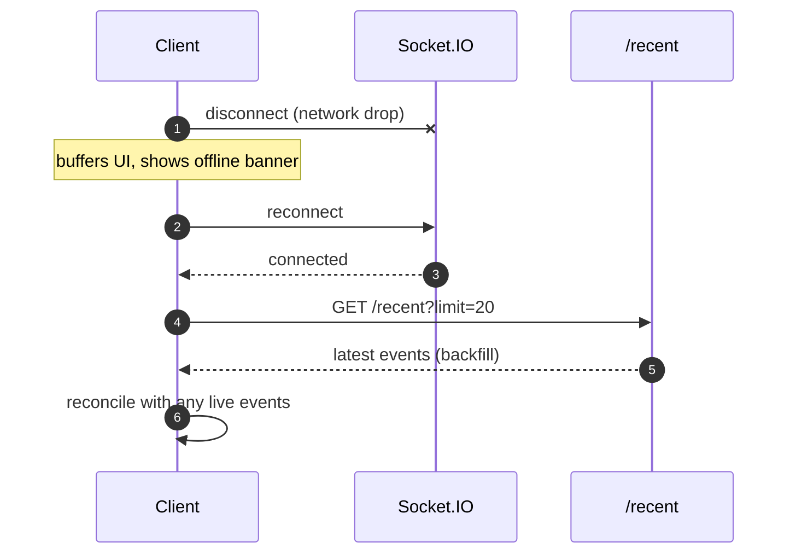
```mermaid
sequenceDiagram
    autonumber
    participant C as Client
    participant IO as Socket.IO
    participant API as /recent

    C-xIO: disconnect (network drop)
    Note over C: buffers UI, shows offline banner
    C->>IO: reconnect
    IO-->>C: connected
    C->>API: GET /recent?limit=20
    API-->>C: latest events (backfill)
    C->>C: reconcile with any live events
```

---

## 15. Logging & Monitoring

### 15.1 Logging Framework

**Pino** with **pino-pretty** in development. All Social Proof logs are prefixed for grep-ability:

- `[SocialProof] ...` — service-level events and broadcast lifecycle.
- `[SocialProofEvent] ...` — persistence + validation.
- `[Socket.IO] ...` — socket lifecycle + broadcasts.

### 15.2 Structured Log Points

| Log | Level | Emitted When |
|---|---|---|
| `Event tracking started` | info | Entry into `trackEvent()` |
| `Validation failed` | warn | Joi rejection |
| `Event persisted successfully` | info | After Mongo insert |
| `Event broadcast triggered` | info | After successful emit |
| `Duplicate broadcast prevented` | warn | Set already contains eventId |
| `Broadcast failed but event persisted successfully` | error | Broadcast throws |
| `Metrics aggregation started` / `completed` | info | Metrics service entry/exit |
| `Client connected` / `disconnected` | info | Socket lifecycle |

### 15.3 Request Logging

`requestLogger` middleware attaches request IDs and logs each request. Recommended correlation:

```ts
logger.info({ reqId, ...ctx }, '[SocialProof] Event persisted')
```

### 15.4 Metrics to Emit (Recommended — not yet wired)

| Metric | Type | Description |
|---|---|---|
| `social_proof_events_total{type}` | counter | Events persisted by type |
| `social_proof_broadcast_total` | counter | Successful broadcasts |
| `social_proof_broadcast_failures_total` | counter | Broadcast failures |
| `social_proof_recent_latency_ms` | histogram | `/recent` latency |
| `social_proof_metrics_latency_ms` | histogram | `/metrics` latency |
| `socketio_connections_current` | gauge | Live socket connections |

Emit via Prometheus (`prom-client`) — expose at `/metrics/prometheus` guarded by network policy.

### 15.5 Health Checks

Add (recommended):

- `GET /health/live` — process is up.
- `GET /health/ready` — Mongo reachable, Socket.IO initialised.

### 15.6 Audit Logs

Because events are append-only and stored in Mongo, the collection itself acts as the audit log. For compliance the collection can be replicated to a WORM store (e.g. S3 Object Lock) via Change Streams.

---

## 16. Security

### 16.1 Threat Model Summary

| Threat | Mitigation |
|---|---|
| Denial of service on public reads | `express-rate-limit` global limiter (100 req / 15 min / IP). |
| Injection via `metadata` | `Joi.object().unknown(true)` accepts any keys but Mongoose stores `Mixed`; the value is **never `eval`ed**, and the message formatter reads specific string fields only. |
| Reflected XSS via message | Client is responsible for HTML-escaping. Server does not currently sanitise strings (recommended: strip HTML at write-time). |
| Unauthorised socket subscription | Currently open — see §5.4 for JWT gating. |
| PII exposure | `metadata` should only contain the user's display name (already the case in producers). Emails, phone numbers, addresses **must not** be added. |
| Insecure headers | `helmet()` applied globally. |
| CORS | `cors()` — configurable via `CORS_ORIGIN` env for Socket.IO. Tighten in production. |
| Env leakage | Secrets loaded via `dotenv`; never logged. |

### 16.2 JWT Validation

Not applied to Social Proof read endpoints. Applied via the producer routes (auth, orders, reviews) upstream of `trackEvent()`.

### 16.3 Input Validation

- Every HTTP entry point runs through `validate(...)` before the controller.
- Every service entry point (`trackEvent`) re-validates its payload — never trusts callers.

### 16.4 Injection Prevention

- Mongoose queries are parameterised — no string concatenation with user input.
- ObjectId inputs are pattern-checked at Joi before hitting Mongo.

### 16.5 Rate Limiting

Global limiter at `/api`. Recommended stricter per-IP limiter on `/social-proof/recent`:

```ts
const recentLimiter = rateLimit({ windowMs: 60_000, max: 30 });
router.get('/recent', recentLimiter, validate(...), getRecentSocialProofEvents);
```

### 16.6 Environment Variables

| Variable | Purpose | Notes |
|---|---|---|
| `PORT` | HTTP port | Default 3000 |
| `CORS_ORIGIN` | Socket.IO CORS allow-list | Default `*` — tighten in prod |
| `JWT_SECRET` | Used by producer flows | Never log |
| `MONGO_URI` | Mongo connection | Never log |
| `REDIS_URL` (future) | Redis for cache + adapter | — |

---

## 17. Performance Optimization

### 17.1 Current Optimisations

| Technique | Where | Impact |
|---|---|---|
| `.lean()` reads | `findRecentSocialProofEventsInDb` | Skips Mongoose hydration; ~3–5× faster. |
| `Promise.all` parallel counts | `getSocialProofMetrics` | 4 sequential queries → 1 parallel round trip. |
| Compound index on `(productId, type, createdAt)` | Model | Serves product-level filtered queries directly. |
| Metadata snapshotting (userName, productName) | Order & Review services | Avoids N+1 joins at read-time. |
| Non-blocking broadcast | `trackEvent` catches broadcast errors | Producer flow throughput preserved. |
| In-memory dedup Set | `trackEvent` | O(1) dedup lookup; scheduled 1h cleanup prevents memory bloat. |

### 17.2 Recommended Additional Indexes

Add `{ type: 1, createdAt: -1 }` to explicitly serve `countEventsByTypeInDateRange`:

```ts
SocialProofEventSchema.index({ type: 1, createdAt: -1 });
```

### 17.3 Pagination Recommendations

Introduce cursor-based pagination when `/recent` needs to be scrolled beyond 100:

- Cursor = `createdAt` of the last returned document.
- Query: `find({ createdAt: { $lt: cursor } }).sort({ createdAt: -1 }).limit(n)`.

### 17.4 Aggregation Optimisation

For `countDistinctActiveUsersInDateRange`, if today's event volume grows large, switch to precomputed HyperLogLog buckets or maintain a rolling `daily_active_users` collection updated on write.

### 17.5 Socket Optimisation

- Batch broadcasts if event rate exceeds ~100/s (`io.emit` per-tick coalescing).
- Enable Socket.IO **compression** and **perMessageDeflate** for large payloads (unnecessary today given payload size).
- Scale-out via Redis adapter (see §8.7).

### 17.6 Connection Pooling

Mongoose default pool (5). For 100+ rps, raise via `mongoose.connect(uri, { maxPoolSize: 50 })`.

### 17.7 Batch Processing

If producers fire many events per second per user (e.g. VIEW events), batch on the producer side and call `trackEvent` on a debounced interval to reduce write pressure.

---

## 18. Testing Strategy

> The project does not yet include a formal test harness. This section documents the recommended structure.

### 18.1 Unit Tests

| Target | What to Cover |
|---|---|
| `socialProofMessage.generateMessage` | Every event type × (metadata present, missing, malformed). Pure function — trivial to test. |
| `socialProofEvent.repository` (mocked model) | Query shapes for each function. |
| `trackEvent` (with mocked repositories) | Joi failures, reference validation, dedup, broadcast wiring, error swallowing. |
| `getSocialProofMetrics` | UTC boundary math + parallel aggregation composition. |

### 18.2 Integration Tests

Spin up a real Mongo (in-memory `mongodb-memory-server`) and:

- Persist events → assert `/recent` returns them.
- Persist SIGNUP/PURCHASE/REVIEW today → assert `/metrics` counts.
- Persist an event **yesterday** → assert it is NOT counted.
- Persist events with `userId=null` → assert not counted in active users.

### 18.3 API Tests

`supertest` against the Express app:

- `GET /recent?limit=0` → 400
- `GET /recent?limit=200` → 400
- `GET /recent?limit=abc` → 400
- `GET /recent` → 200 + shape check
- `GET /metrics` → 200 + all four fields as integers

### 18.4 Socket Tests

Use `socket.io-client` in tests:

- Connect two clients → call `trackEvent` → both receive `social-proof:new`.
- Call `trackEvent` twice with same doc (simulate) → only one broadcast (via internal `broadcastedEventIds`).

### 18.5 Performance / Load Tests

- **k6** or **autocannon** on `/recent` at 500 rps → assert p95 < 150 ms.
- Broadcast fan-out with 1 000 idle Socket.IO clients → CPU + memory profile.

### 18.6 Mocking Strategy

- Repositories are already pure functions → replace via `jest.mock`.
- `broadcastSocialProofEvent` can be mocked to a spy to assert emit occurred without a live socket server.
- Use `sinon.useFakeTimers()` to fast-forward the 1 h dedup cleanup timer.

---

## 19. Sequence Diagrams

### 19.1 Feed Creation (Producer → Broadcast)

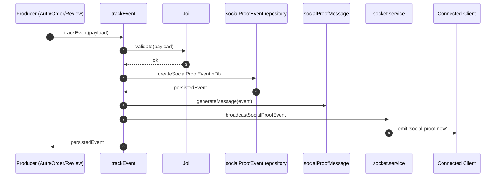
```mermaid
sequenceDiagram
    autonumber
    participant Prod as Producer (Auth/Order/Review)
    participant Svc as trackEvent
    participant Joi
    participant Repo as socialProofEvent.repository
    participant Msg as socialProofMessage
    participant Sock as socket.service
    participant Client as Connected Client

    Prod->>Svc: trackEvent(payload)
    Svc->>Joi: validate(payload)
    Joi-->>Svc: ok
    Svc->>Repo: createSocialProofEventInDb
    Repo-->>Svc: persistedEvent
    Svc->>Msg: generateMessage(event)
    Svc->>Sock: broadcastSocialProofEvent
    Sock->>Client: emit 'social-proof:new'
    Svc-->>Prod: persistedEvent
```

### 19.2 Feed Retrieval

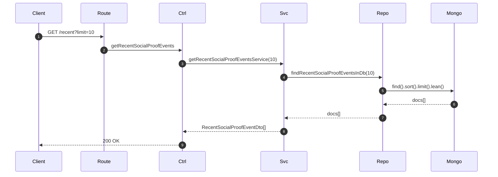
```mermaid
sequenceDiagram
    autonumber
    participant Client
    participant Route
    participant Ctrl
    participant Svc
    participant Repo
    participant Mongo

    Client->>Route: GET /recent?limit=10
    Route->>Ctrl: getRecentSocialProofEvents
    Ctrl->>Svc: getRecentSocialProofEventsService(10)
    Svc->>Repo: findRecentSocialProofEventsInDb(10)
    Repo->>Mongo: find().sort().limit().lean()
    Mongo-->>Repo: docs[]
    Repo-->>Svc: docs[]
    Svc-->>Ctrl: RecentSocialProofEventDto[]
    Ctrl-->>Client: 200 OK
```

### 19.3 Feed Update — Not Applicable

Events are immutable. Diagram intentionally omitted.

### 19.4 Feed Deletion — Not Applicable

Append-only collection. Diagram intentionally omitted (compliance deletes go through admin tooling, not the Social Proof API).

### 19.5 Like Flow — Not Applicable

The current Social Proof scope does not include user reactions.

### 19.6 Comment Flow — Not Applicable

Comments are outside Social Proof scope.

### 19.7 Share Flow — Not Applicable

Sharing is a client-side capability. If server-tracked, it would be an additional `SocialProofEventType.SHARE` — trivial to add via the extensible enum + template map.

### 19.8 Metric Retrieval

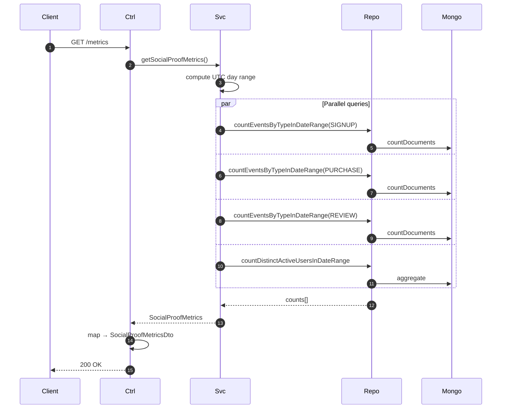
```mermaid
sequenceDiagram
    autonumber
    participant Client
    participant Ctrl
    participant Svc
    participant Repo
    participant Mongo

    Client->>Ctrl: GET /metrics
    Ctrl->>Svc: getSocialProofMetrics()
    Svc->>Svc: compute UTC day range
    par Parallel queries
        Svc->>Repo: countEventsByTypeInDateRange(SIGNUP)
        Repo->>Mongo: countDocuments
    and
        Svc->>Repo: countEventsByTypeInDateRange(PURCHASE)
        Repo->>Mongo: countDocuments
    and
        Svc->>Repo: countEventsByTypeInDateRange(REVIEW)
        Repo->>Mongo: countDocuments
    and
        Svc->>Repo: countDistinctActiveUsersInDateRange
        Repo->>Mongo: aggregate
    end
    Repo-->>Svc: counts[]
    Svc-->>Ctrl: SocialProofMetrics
    Ctrl->>Ctrl: map → SocialProofMetricsDto
    Ctrl-->>Client: 200 OK
```

### 19.9 Socket Connection

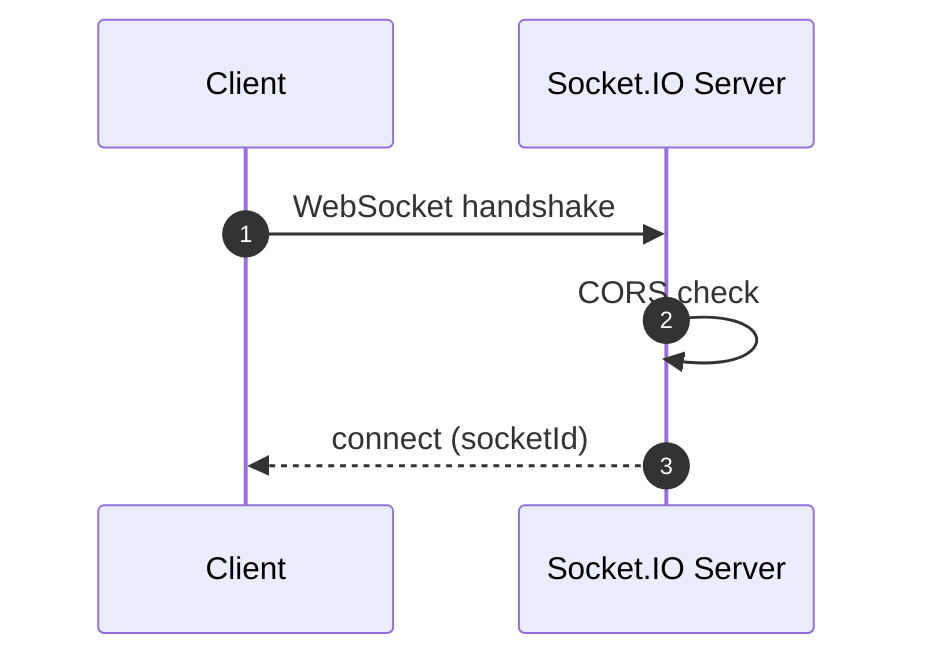
```mermaid
sequenceDiagram
    autonumber
    participant Client
    participant IO as Socket.IO Server
    Client->>IO: WebSocket handshake
    IO->>IO: CORS check
    IO-->>Client: connect (socketId)
```

### 19.10 Socket Authentication (Recommended Design)

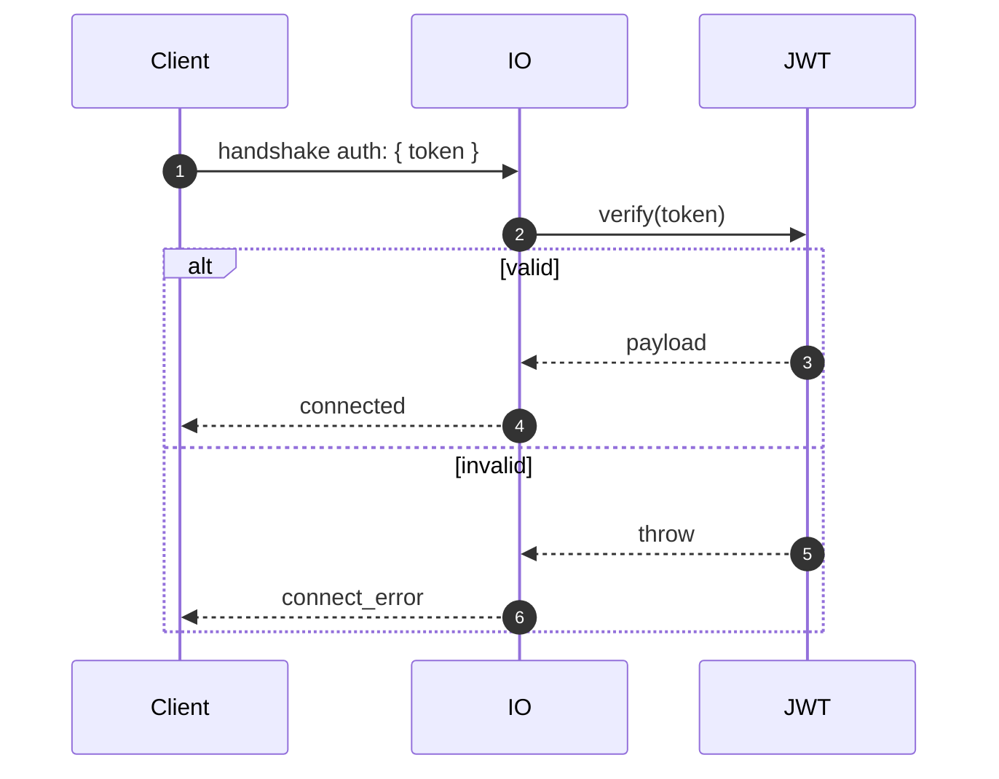
```mermaid
sequenceDiagram
    autonumber
    participant Client
    participant IO
    participant JWT

    Client->>IO: handshake auth: { token }
    IO->>JWT: verify(token)
    alt valid
        JWT-->>IO: payload
        IO-->>Client: connected
    else invalid
        JWT-->>IO: throw
        IO-->>Client: connect_error
    end
```

### 19.11 Live Feed Update (End-to-End)

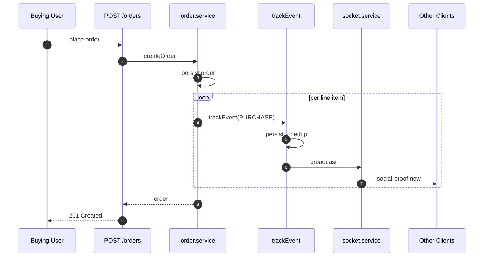
```mermaid
sequenceDiagram
    autonumber
    participant User as Buying User
    participant API as POST /orders
    participant OrderSvc as order.service
    participant SPSvc as trackEvent
    participant Sock as socket.service
    participant Others as Other Clients

    User->>API: place order
    API->>OrderSvc: createOrder
    OrderSvc->>OrderSvc: persist order
    loop per line item
        OrderSvc->>SPSvc: trackEvent(PURCHASE)
        SPSvc->>SPSvc: persist + dedup
        SPSvc->>Sock: broadcast
        Sock->>Others: social-proof:new
    end
    OrderSvc-->>API: order
    API-->>User: 201 Created
```

### 19.12 Notification Flow

Client-side toast / snackbar rendering is triggered off the `social-proof:new` payload:

```mermaid
sequenceDiagram
    autonumber
    participant Server
    participant Client
    participant UI as UI Layer

    Server->>Client: emit 'social-proof:new' { id, message, createdAt }
    Client->>Client: enqueue notification
    Client->>UI: render toast (auto-dismiss 3–5s)
    UI-->>Client: dismiss
```

---

## 20. Architecture Diagrams

### 20.1 Social Proof Backend Architecture (Full)

```mermaid
flowchart TB
    subgraph Client
        MW[Mobile / Web App]
    end

    subgraph Edge[Edge Middleware]
        HELMET[helmet]
        CORS_M[cors]
        RATE[apiLimiter]
    end

    subgraph HTTP[HTTP Layer]
        R[socialProof.routes]
        VAL[validate.middleware]
        C[socialProof.controller]
    end

    subgraph Domain[Domain Layer]
        S[socialProof.service]
        MSG[socialProofMessage]
        DEDUP[(In-Memory Set<br/>broadcastedEventIds)]
    end

    subgraph Real[Real-Time Layer]
        SOCK[socket.service<br/>Socket.IO]
    end

    subgraph Data[Data Layer]
        REPO[socialProofEvent.repository]
        UREPO[user.repository]
        PREPO[product.repository]
        DB[(MongoDB<br/>social_proof_events)]
    end

    subgraph Producers[Producer Services]
        AUTH[auth]
        ORDER[order]
        REVIEW[review]
    end

    MW -->|HTTP| HELMET --> CORS_M --> RATE --> R
    R --> VAL --> C --> S
    S --> REPO --> DB
    S --> UREPO --> DB
    S --> PREPO --> DB
    S --> MSG
    S --> DEDUP
    S --> SOCK
    SOCK -->|WebSocket| MW

    AUTH --> S
    ORDER --> S
    REVIEW --> S
```

### 20.2 Request Lifecycle

```mermaid
flowchart LR
    A[Client Request] --> B[helmet]
    B --> C[cors]
    C --> D[apiLimiter]
    D --> E[express.json]
    E --> F[Route]
    F --> G[validate]
    G --> H[Controller]
    H --> I[Service]
    I --> J[Repository]
    J --> K[(MongoDB)]
    K --> J --> I --> L[DTO Map]
    L --> H --> M[ApiResponse]
    M --> N[Client Response]
```

### 20.3 Repository Pattern

```mermaid
classDiagram
    class SocialProofEventRepository {
        +createSocialProofEventInDb(data): ISocialProofEvent
        +findRecentSocialProofEventsInDb(limit): ISocialProofEvent[]
        +countEventsByTypeInDateRange(type, start, end): number
        +countDistinctActiveUsersInDateRange(start, end): number
    }
    class SocialProofService {
        +trackEvent(payload)
        +getRecentSocialProofEventsService(limit)
        +getSocialProofMetrics()
    }
    class SocketService {
        +initializeSocket(httpServer)
        +getSocketInstance()
        +broadcastSocialProofEvent(payload)
    }
    class SocialProofEventModel {
        <<Mongoose>>
        +type
        +userId
        +productId
        +metadata
        +createdAt
    }

    SocialProofService --> SocialProofEventRepository
    SocialProofService --> SocketService
    SocialProofEventRepository --> SocialProofEventModel
```

### 20.4 Database Relationships

```mermaid
erDiagram
    USER ||--o{ SOCIAL_PROOF_EVENT : "userId"
    PRODUCT ||--o{ SOCIAL_PROOF_EVENT : "productId"
    ORDER ||--o{ SOCIAL_PROOF_EVENT : "creates via order.service"
    REVIEW ||--o{ SOCIAL_PROOF_EVENT : "creates via review.service"
```

### 20.5 Socket Architecture

```mermaid
flowchart LR
    HTTP[HTTP Server] --> IO[Socket.IO Server<br/>Singleton]
    IO --> NS[Default Namespace /]
    NS --> R1[No Rooms Today]
    NS -.->|future| PROD_ROOM[product:productId]
    NS -.->|future| USER_ROOM[user:userId]

    SP[Social Proof Service] -->|broadcastSocialProofEvent| IO
    IO -->|social-proof:new| C1[Client 1]
    IO -->|social-proof:new| C2[Client 2]
    IO -->|social-proof:new| Cn[Client N]

    subgraph MultiInstance[Multi-Instance Scale-Out - Future]
        IO2[Socket.IO Node 2] -.-> REDIS[(Redis Pub/Sub Adapter)]
        IO -.-> REDIS
    end
```

### 20.6 Cache Flow (Recommended)

```mermaid
flowchart TB
    REQ[GET /recent or /metrics] --> CACHE{Redis Hit?}
    CACHE -->|yes| RESP[Return cached]
    CACHE -->|no| DB[(MongoDB)]
    DB --> POP[Populate Redis with TTL]
    POP --> RESP
```

### 20.7 Metric Processing Flow

```mermaid
flowchart LR
    A[GET /metrics] --> B[Compute UTC day range]
    B --> C{Promise.all}
    C --> D1[count SIGNUP]
    C --> D2[count PURCHASE]
    C --> D3[count REVIEW]
    C --> D4[distinct active users]
    D1 & D2 & D3 & D4 --> E[Assemble Internal Metrics]
    E --> F[Map to API DTO]
    F --> G[200 OK]
```

---

## 21. Best Practices

### 21.1 Modular Architecture

- Keep Social Proof cross-references (user/product) at the service layer — never let repositories import each other.
- Consider migrating to `src/modules/social-proof/*` (see §4.1) as the codebase grows.

### 21.2 SOLID Principles Applied

| Principle | Application in this Feature |
|---|---|
| **S**ingle Responsibility | Controller = HTTP; Service = domain; Repository = data; Formatter = presentation. |
| **O**pen/Closed | New event types require **only** adding to the enum and the `MESSAGE_TEMPLATES` map — no changes to `trackEvent`. |
| **L**iskov Substitution | Repository functions return the same `ISocialProofEvent` shape regardless of query path. |
| **I**nterface Segregation | DTOs are minimal — clients get only `id/message/createdAt`, not internal fields. |
| **D**ependency Inversion | Services receive repositories via module imports (easily mockable); Socket.IO is accessed through `broadcastSocialProofEvent` — services do not depend on `io` directly. |

### 21.3 Repository Pattern

- Repository functions are **stateless and side-effect free** (except DB writes).
- Never leak Mongoose documents beyond the service — DTOs are the boundary.

### 21.4 Error Handling

- Wrap producer calls to `trackEvent` in try/catch and swallow errors.
- Wrap `broadcastSocialProofEvent` internally in try/catch — never re-throw broadcasts.
- Return sanitised messages from the API; keep stack traces in logs only.

### 21.5 Validation

- Validate at the **HTTP boundary** and re-validate at the **service boundary** — never trust the caller.
- Use Joi defaults to avoid `undefined` branches downstream (`limit` defaults to 10; `metadata` defaults to `{}`).

### 21.6 Logging

- Prefix all logs with `[SocialProof]` / `[Socket.IO]` for consistent filtering.
- Log entry, success, and error for every state transition — but **never** log full user PII or payloads verbatim.
- Attach a request ID for cross-service correlation.

### 21.7 Security

- Publish only public, non-PII data over the `social-proof:new` channel.
- Rate-limit read endpoints per-IP.
- Plan for JWT-gated socket handshakes as user-specific features are added.

### 21.8 Performance

- Prefer `.lean()` and covered queries.
- Prefer parallel queries (`Promise.all`) over sequential.
- Snapshot user/product names into `metadata` to avoid read-time joins.
- Add TTL indexes for retention rather than manual cleanup jobs.

### 21.9 Testing

- Unit-test pure functions (`generateMessage`) first — highest ROI.
- Integration-test the repository against `mongodb-memory-server`.
- Contract-test the socket channel with a real `socket.io-client`.

### 21.10 Scalability

- Migrate the in-memory dedup Set to Redis before horizontal scale-out.
- Introduce the Socket.IO Redis adapter before deploying to multiple nodes.
- Consider a queue (BullMQ) between `trackEvent` and broadcast if event volume becomes bursty.

### 21.11 Maintainability

- Message templates centralised in one file → i18n is a drop-in replacement.
- Enum-driven event types → the compiler enforces exhaustiveness.
- Internal metric names decoupled from API DTO names → future-proof contract.

---

## Appendix A — File Reference

| Concern | File |
|---|---|
| Route wiring | [src/routes/socialProof.routes.ts](../src/routes/socialProof.routes.ts) |
| Controllers | [src/controllers/socialProof.controller.ts](../src/controllers/socialProof.controller.ts) |
| Service | [src/services/socialProof.service.ts](../src/services/socialProof.service.ts) |
| Socket service | [src/services/socket.service.ts](../src/services/socket.service.ts) |
| Repository | [src/repositories/socialProofEvent.repository.ts](../src/repositories/socialProofEvent.repository.ts) |
| Model | [src/models/socialProofEvent.model.ts](../src/models/socialProofEvent.model.ts) |
| DTO | [src/dtos/socialProof.dto.ts](../src/dtos/socialProof.dto.ts) |
| Validators | [src/validations/socialProof.validation.ts](../src/validations/socialProof.validation.ts) |
| Message formatter | [src/utils/socialProofMessage.ts](../src/utils/socialProofMessage.ts) |
| Bootstrap (Socket.IO init) | [src/server.ts](../src/server.ts) |
| Producer: signup | [src/controllers/authController.ts](../src/controllers/authController.ts) |
| Producer: purchase | [src/services/order.service.ts](../src/services/order.service.ts) |
| Producer: review | [src/services/review.service.ts](../src/services/review.service.ts) |

---

## Appendix B — Assumptions & Trade-offs

| # | Assumption / Trade-off | Rationale |
|---|---|---|
| 1 | Read endpoints are public | Social proof value is the openness of the data. |
| 2 | Events are append-only, no updates or deletes | Editing history would falsify social proof. |
| 3 | In-memory dedup Set is sufficient for single-instance deployments | Simplicity; migration path to Redis documented (§13.4). |
| 4 | Snapshot user/product data into `metadata` at write-time | Removes read-time joins; accepts data drift as an intentional feature (past events reflect past state). |
| 5 | Metrics use UTC-day boundaries | Consistent globally; timezone-aware buckets are a future refinement. |
| 6 | Socket.IO handshake is currently open | Data is public; JWT-gating recommended once user-specific rooms are added. |
| 7 | No queue between `trackEvent` and broadcast | Current volume is low; introducing a queue is a scale-time decision. |
| 8 | Broadcast failures never fail the producer flow | Business flows must never be broken by observability side-effects. |

---

**Document End.**
