# Video Call Feature - Architecture & Working

## Overview

The video call feature implements **WebRTC peer-to-peer** calling with **Socket.IO signaling**. The server acts as a signaling relay — it does **not** handle media streams. Audio/video flows directly between clients via WebRTC.

---

## Architecture Diagram

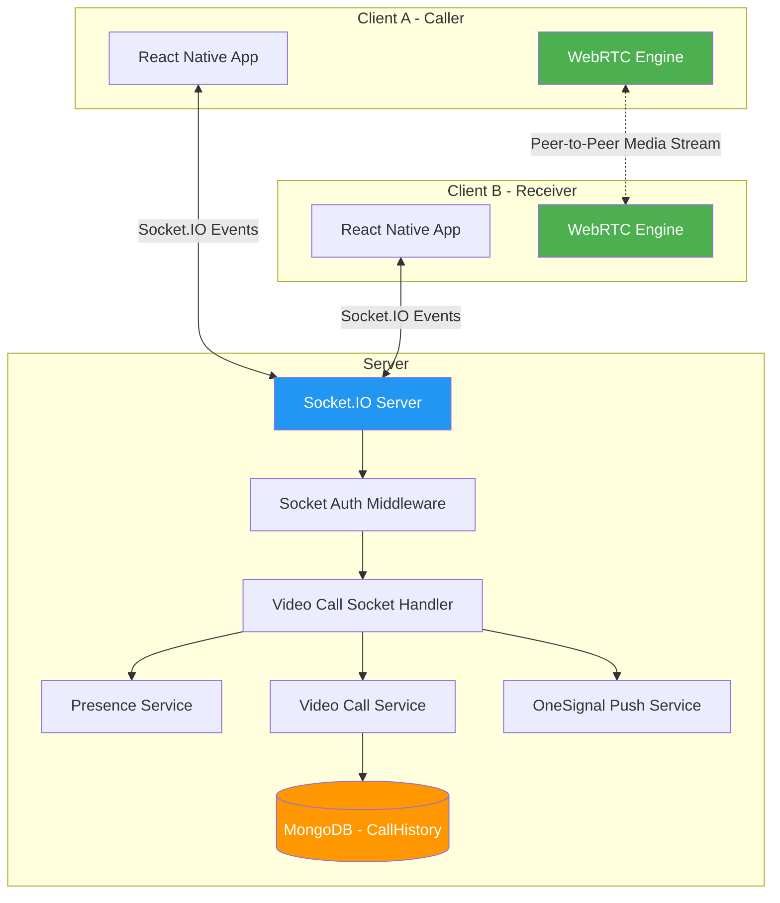

---

## File Structure

| File | Purpose |
|------|---------|
| `socket/videoCall.socket.ts` | Main socket handler — routes all signaling events |
| `services/videoCall.service.ts` | Call history CRUD — persists call records to MongoDB |
| `services/presence.service.ts` | In-memory user presence — tracks who is online |
| `interfaces/videoCall.interface.ts` | TypeScript types for all payloads |
| `constants/videoCall.constants.ts` | Event names, status enums, timeouts |
| `validators/videoCall.validator.ts` | Joi schemas for payload validation |
| `middlewares/socketAuth.middleware.ts` | JWT auth on socket connection |
| `models/callHistory.model.ts` | Mongoose schema for call records |
| `utils/videoCall.logger.ts` | Structured logging for call events |
| `types/socket.types.ts` | Typed Socket.IO server/socket definitions |

---

## Connection & Authentication Flow

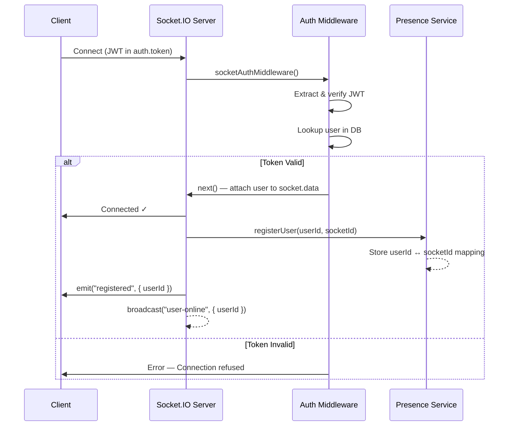

---

## Complete Call Flow (Happy Path)

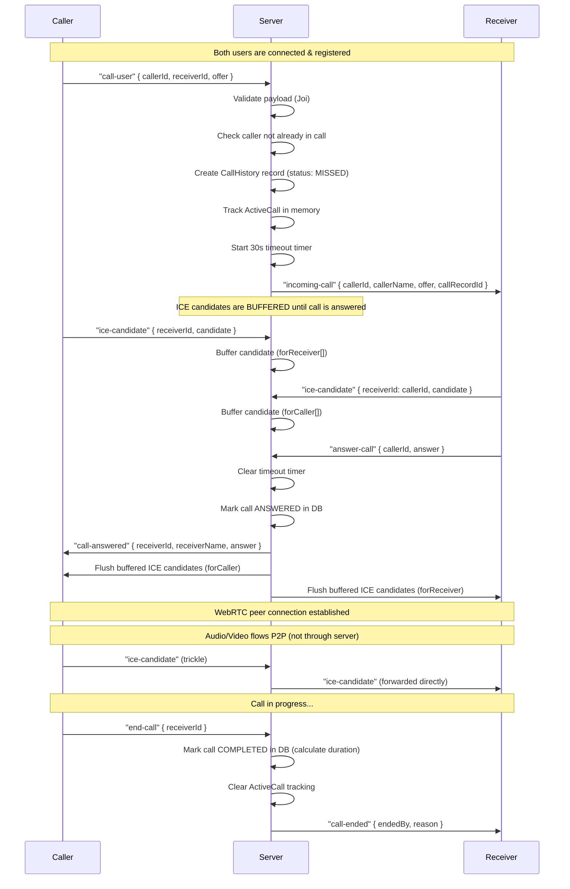

---

## Call Rejection Flow

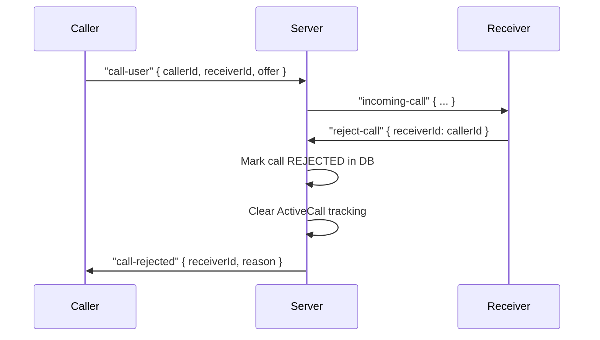

---

## Missed Call Flow (Timeout)

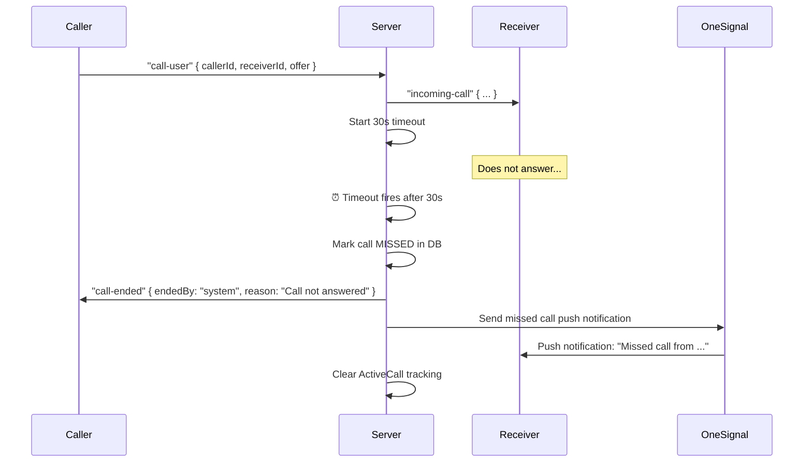

---

## Receiver Offline Flow

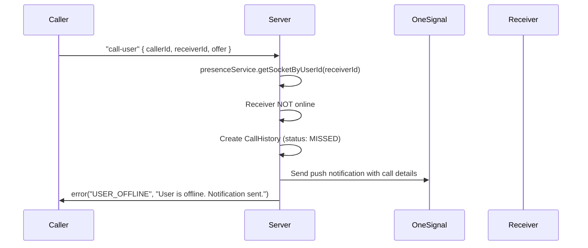

---

## Disconnect & Reconnection Handling

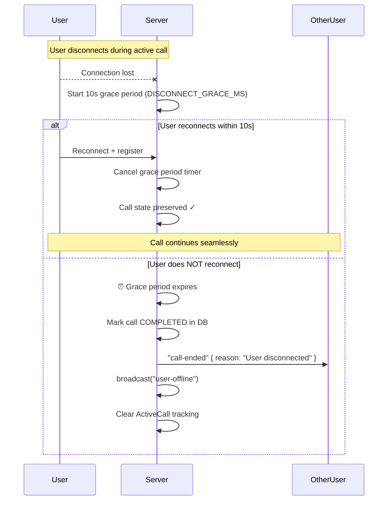

---

## In-Memory State Management

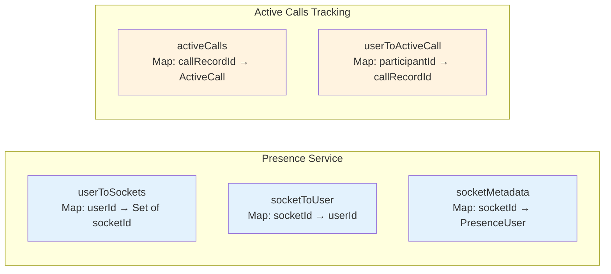

### ActiveCall Object Structure:
```
{
  callRecordId: string        // MongoDB _id
  callerId: string            // Who initiated
  receiverId: string          // Who was called
  startedAt: Date
  answered: boolean           // Controls ICE buffering
  timeoutId: NodeJS.Timeout   // 30s unanswered timer
  disconnectTimeoutId: Timeout // 10s reconnect grace
  bufferedCandidates: {
    forCaller: ICECandidate[]   // From receiver, waiting for answer
    forReceiver: ICECandidate[] // From caller, waiting for answer
  }
}
```

---

## ICE Candidate Buffering Strategy

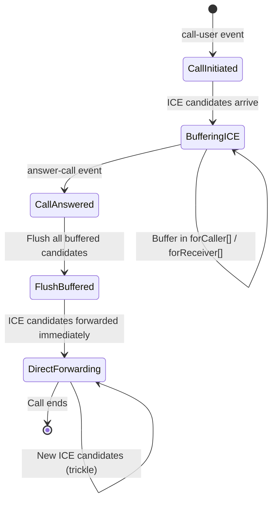

**Why buffer?** WebRTC ICE candidates can arrive before the answer SDP is set on the remote peer. Forwarding them too early causes them to be dropped. The server buffers all candidates until `answer-call` is received, then flushes them in order.

---

## Socket Events Reference

### Client → Server Events

| Event | Payload | Description |
|-------|---------|-------------|
| `register-user` | — | Register for calls (auto-called on connect) |
| `get-online-users` | — | Request list of online user IDs |
| `call-user` | `{ callerId, receiverId, offer }` | Initiate a call with WebRTC offer |
| `answer-call` | `{ callerId, answer }` | Answer incoming call with WebRTC answer |
| `ice-candidate` | `{ receiverId, candidate }` | Send ICE candidate to peer |
| `reject-call` | `{ receiverId }` | Reject an incoming call |
| `end-call` | `{ receiverId }` | End an active call |

### Server → Client Events

| Event | Payload | Description |
|-------|---------|-------------|
| `registered` | `{ userId, message }` | Registration confirmed |
| `online-users` | `{ userIds[] }` | List of online users |
| `incoming-call` | `{ callerId, callerName, offer, callRecordId }` | Incoming call notification |
| `call-answered` | `{ receiverId, receiverName, answer }` | Call was answered |
| `ice-candidate` | `{ senderId, candidate }` | ICE candidate from peer |
| `call-rejected` | `{ receiverId, reason }` | Call was rejected |
| `call-ended` | `{ endedBy, reason }` | Call was ended |
| `user-online` | `{ userId, userName }` | A user came online |
| `user-offline` | `{ userId, userName }` | A user went offline |
| `error` | `{ code, message, details? }` | Error occurred |

---

## Call Status Lifecycle

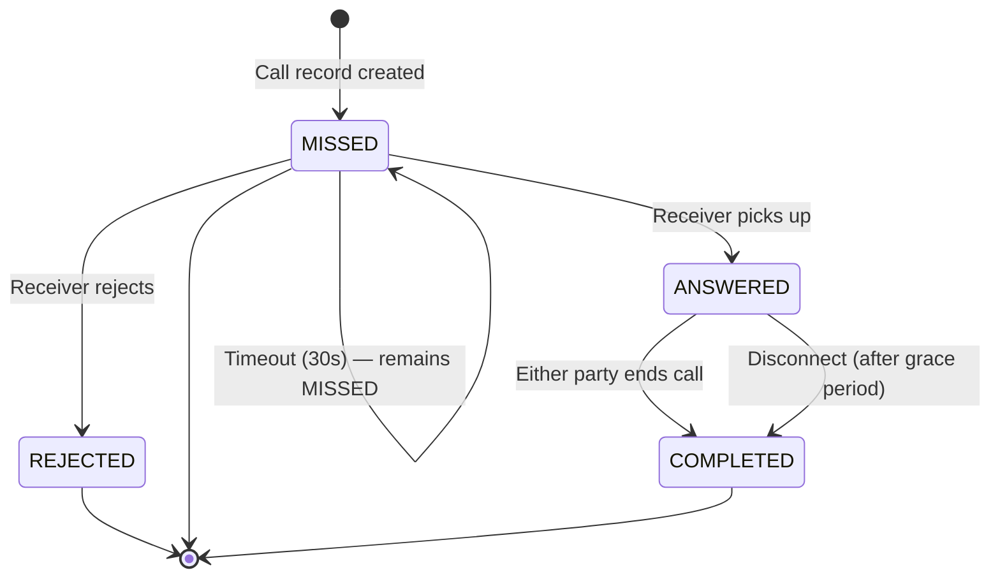

---

## Configuration Constants

| Constant | Value | Purpose |
|----------|-------|---------|
| `CALL_TIMEOUT_MS` | 30,000ms (30s) | Time to wait before marking call as missed |
| `DISCONNECT_GRACE_MS` | 10,000ms (10s) | Grace period for reconnection during call |
| `MAX_ICE_CANDIDATES` | 50 | Max buffered ICE candidates |
| `pingTimeout` | 60,000ms | Socket.IO ping timeout |
| `pingInterval` | 25,000ms | Socket.IO ping interval |

---

## Error Codes

| Code | When |
|------|------|
| `UNAUTHORIZED` | Invalid JWT or caller ID mismatch |
| `USER_NOT_FOUND` | Receiver doesn't exist or is deleted |
| `USER_OFFLINE` | Receiver has no active socket connection |
| `INVALID_PAYLOAD` | Joi validation failed on event payload |
| `CALL_FAILED` | Already in call, or no active call found |
| `INTERNAL_ERROR` | Unexpected server error |

---

## Database Schema (CallHistory)

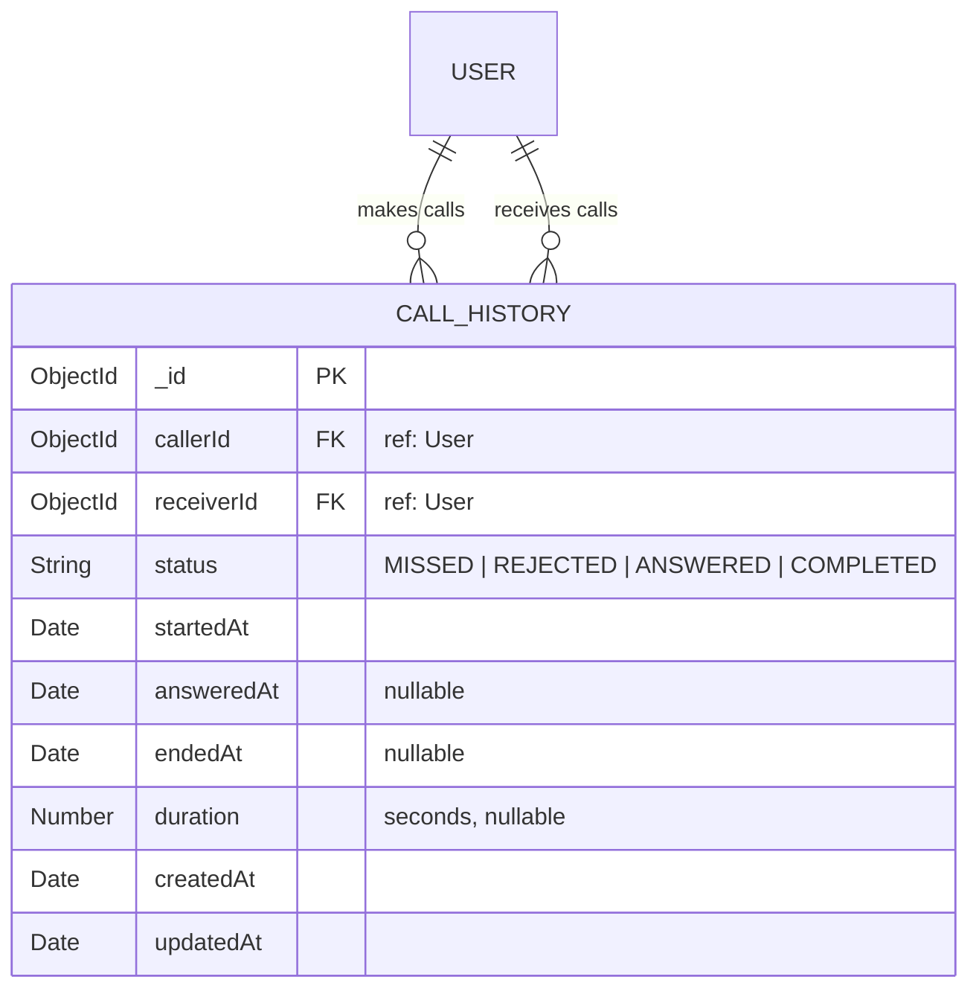

---

## Multi-Device Support

The presence service supports **multiple sockets per user** (e.g., phone + tablet). Key behaviors:

- `userToSockets` maps each userId to a **Set of socketIds**
- `getSocketByUserId()` returns the **first** socket (for call routing)
- `removeBySocketId()` only marks user offline when the **last** socket disconnects
- `user-online` / `user-offline` events broadcast only on **first connect** / **last disconnect**

---

## Push Notifications (OneSignal)

When the receiver is **offline**, the server sends a push notification via OneSignal containing:
- Caller's name and ID
- Call record ID (for deep linking into the app)

When a call is **missed** (30s timeout), a separate missed call notification is sent.
